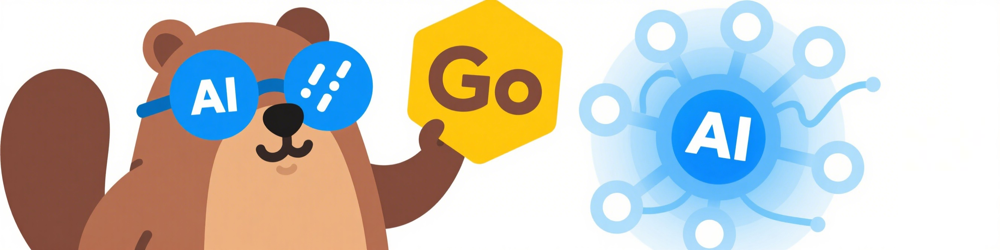
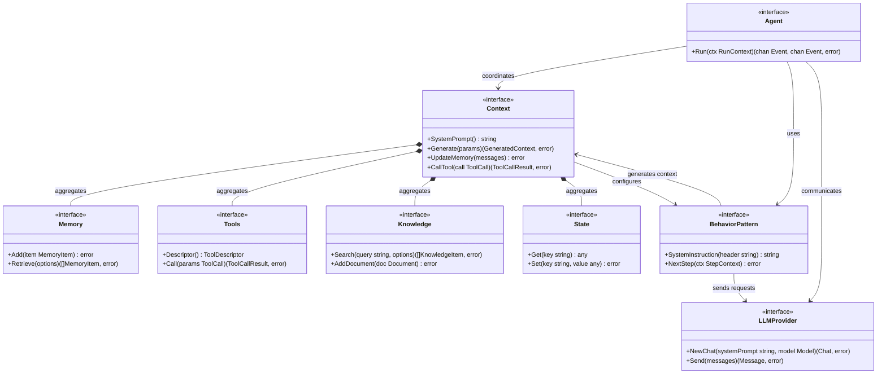
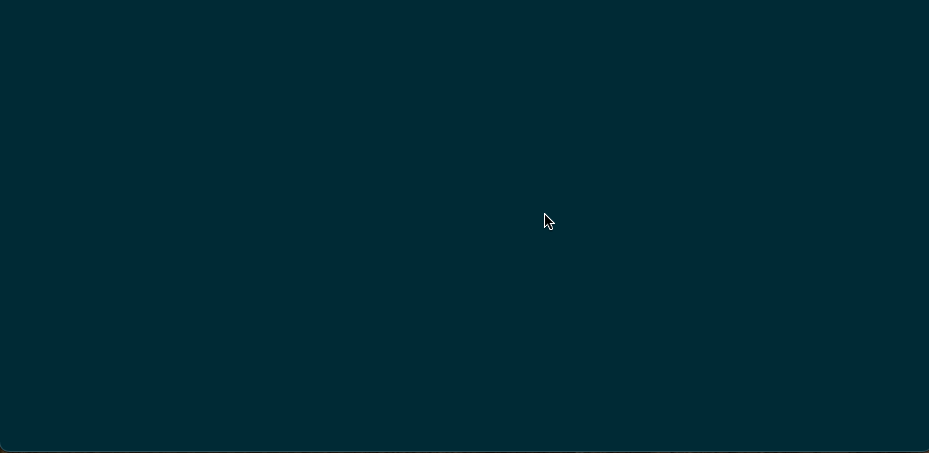

# Agent-Go

<div align="center">


**A lightweight LLM agent framework built with Go**


[](README.md#configuration)
[](https://github.com/bytedance/WebTranslator)
[](LICENSE)
[](README.md#overview)
[](https://github.com/oopslink/agent-go/actions/workflows/build_on_push.yml)

</div>

## Overview

Agent-Go is a **learning project** designed to understand fundamental concepts and methodologies in the Agent domain. This framework is implemented in Go and serves as a comprehensive exploration of LLM Agent architectures, patterns, and best practices.

> **Note**: This is a learning project intended for educational purposes. While it implements many production-ready features, it should be evaluated carefully before use in production environments.

### Architecture

The diagram below illustrates the core components and their relationships in the Agent-Go framework:



**Key Components:**
- **Agent**: Orchestrates the entire interaction flow through event-driven channels
- **Context**: Manages execution environment and coordinates all components
- **Behavior Pattern**: Defines reasoning strategies (Generic, CoT, ReAct, RAG, Plan&Execute)
- **Memory**: Stores conversation history and maintains context
- **Tools**: Provides external capabilities (search, weather, custom functions)
- **Knowledge**: Domain-specific information via vector search
- **State**: Tracks session and step-level state information
- **LLM Provider**: Handles communication with language models

## Features

### Core Capabilities
- **Golang Implementation**: Built with Go for performance and simplicity
- **Asynchronous Design**: Non-blocking operations for better scalability
- **Multi-Provider Support**: Unified interface for multiple LLM providers (OpenAI, Anthropic, Gemini)
- **Function Calling**: Native support for tool/function calling capabilities
- **Streaming Conversations**: Real-time streaming responses for interactive experiences
- **Retrieval-Augmented Generation (RAG)**: Knowledge retrieval and context enhancement
- **Memory Management**: Persistent conversation memory and state management
- **Journal System**: Complete execution process recording and token usage statistics tracking
- **Agent Behavior Patterns**: Support for various agent patterns including:
  - Chain of Thought (CoT)
  - ReAct (Reasoning and Acting)
  - Plan and Execute
  - RAG (Retrieval-Augmented Generation)
- **MCP (Model Context Protocol)**: Integration with MCP for enhanced tool capabilities
- **Vector Database Support**: Built-in vector storage for knowledge management

### Architecture Highlights
- **Modular Design**: Pluggable components for easy customization
- **Event-Driven**: Event bus for loose coupling between components
- **Extensible**: Easy to add new providers, tools, and behaviors
- **Production-Ready**: Comprehensive error handling and logging

## Quick Start

### Prerequisites
- Go 1.21 or higher
- API keys for your preferred LLM providers

### Installation
```bash
git clone https://github.com/oopslink/agent-go.git
cd agent-go
go mod download
```

### Examples

#### Basic Chat Application
```bash
cd examples/apps
make chat CONFIG_PATH=/path/to/config
```

<div align="center">

</div>

#### Behavior Pattern Examples
Explore different agent behavior patterns in the `examples/snippets/` directory:

- **Chain of Thought (CoT)**: `examples/snippets/cot/`
- **ReAct Pattern**: `examples/snippets/react/`
- **Plan and Execute**: `examples/snippets/plan_and_execute/`
- **RAG Implementation**: `examples/snippets/rag/`
- **MCP Integration**: `examples/snippets/mcp/`

#### Quick Development Guide

**Complete Example: Agent with Tools, Memory, and Knowledge**

This example demonstrates how to create an agent that integrates all core components:

```go
package main

import (
  "context"
  "fmt"
  "time"

  "github.com/oopslink/agent-go/pkg/commons/utils"
  "github.com/oopslink/agent-go/pkg/core/agent"
  behaviors "github.com/oopslink/agent-go/pkg/core/agent/behavior_patterns"
  agentcontext "github.com/oopslink/agent-go/pkg/core/agent/context"
  agentstate "github.com/oopslink/agent-go/pkg/core/agent/state"
  "github.com/oopslink/agent-go/pkg/core/knowledge"
  "github.com/oopslink/agent-go/pkg/core/memory"
  "github.com/oopslink/agent-go/pkg/core/tools"
  choresTools "github.com/oopslink/agent-go/pkg/core/tools/chores"
  duckduckgo "github.com/oopslink/agent-go/pkg/core/tools/duckduckgo"
  "github.com/oopslink/agent-go/pkg/support/llms"
  _ "github.com/oopslink/agent-go/pkg/support/llms/openai"
)

func main() {
  // 1. Create LLM Provider
  llmProvider, _ := llms.NewChatProvider(llms.OpenAI,
    llms.WithAPIKey("your-api-key"))

  model, _ := llms.GetModel(llms.ModelId{
    Provider: llms.OpenAI,
    ID:       "gpt-4o-mini",
  })

  // 2. Create Memory (stores conversation history)
  memory := memory.NewInMemoryMemory()

  // 3. Create Tools (external capabilities)
  toolCollection := tools.OfTools(
    choresTools.NewSleepTool(1*time.Second), // Sleep for a while
    duckduckgo.NewDuckDuckGoTool(),          // Web search
  )

  // 4. Create Knowledge Base (vector database backed)
  kb, _ := knowledge.NewKnowledgeBase("company-kb",
    "Company Knowledge Base",
    vectorDBConfig) // Assumes vector database is configured

  // 5. Create Behavior Pattern (reasoning strategy)
  behavior, _ := behaviors.NewReActPattern(10) // ReAct with tools

  // 6. Create Agent Context (coordinates all components)
  agentCtx := agentcontext.NewRuleBaseContext(
    "comprehensive-agent",
    "You are a helpful AI assistant with access to tools and knowledge",
    llmProvider, model, behavior,
    memory,                        // Memory for conversation history
    agentstate.NewInMemoryState(), // State management
    []knowledge.KnowledgeBase{kb}, // Knowledge bases
    toolCollection,                // Available tools
    agentcontext.ContextRules{
      AutoAddToolInstructions: true,
    },
  )

  // 7. Create Agent
  myAgent, _ := agent.NewGenericAgent(agentCtx, behavior, llmProvider, model,
    []llms.ChatOption{llms.WithTemperature(0.7), llms.WithStreaming(true)})

  // 8. Run Agent
  runCtx := &agent.RunContext{
    SessionId: fmt.Sprintf("demo-%s", utils.GenerateUUID()),
    Context:   context.Background(),
  }

  inputChan, outputChan, _ := myAgent.Run(runCtx)

  // 9. Send User Request
  inputChan <- agent.NewUserRequestEvent(&agent.UserRequest{
    Message: "What services does our company offer and what's the weather in New York?",
  })

  // 10. Process Agent Response
  fmt.Println("Question: What services does our company offer and what's the weather in New York?\n")
  for {
    select {
    case <-runCtx.Context.Done():
      return
    case event, ok := <-outputChan:
      if !ok {
        return
      }

      switch event.Topic {
      case agent.EventTypeAgentMessage:
        // Agent's response text
        if messageEvent := agent.GetAgentMessageEventData(event); messageEvent != nil {
          for _, part := range messageEvent.Message.Parts {
            if textPart, ok := part.(*llms.TextPart); ok {
              fmt.Print(textPart.Text)
            }
          }
        }
      case agent.EventTypeExternalAction:
        // Tool calls - agent wants to use external tools
        if actionEvent := agent.GetExternalActionEventData(event); actionEvent != nil {
          fmt.Printf("[🔧 Tool Call] %s: %s\n",
            actionEvent.ToolCall.Name, actionEvent.ToolCall.Arguments)

          // Simulate tool execution and return result to agent
          // In real applications, you might handle this asynchronously
          inputChan <- agent.NewExternalActionResultEvent(&agent.ExternalActionResult{
            ToolCallResult: &llms.ToolCallResult{
              ToolCallId: actionEvent.ToolCall.Id,
              Content:    "Tool execution completed successfully",
            },
          })
        }
      case agent.EventTypeAgentResponseEnd:
        // Conversation completed
        if endEvent := agent.GetAgentResponseEndEventData(event); endEvent != nil {
          if endEvent.Abort {
            fmt.Printf("\n❌ Agent stopped: %v\n", endEvent.Error)
          } else {
            fmt.Printf("\n✅ Agent finished\n")
          }
          return
        }
      }
    }
  }
}
```

**What this example demonstrates:**

- **Agent**: Orchestrates the entire interaction flow using event-driven channels
- **Memory**: Stores conversation history for context across multiple interactions  
- **Tools**: Provides external capabilities like weather lookup and web search
- **Knowledge**: Supplies domain-specific information through vector search
- **Behavior Pattern**: Uses ReAct reasoning to decide when to use tools vs knowledge
- **LLM Provider**: Handles communication with language models (OpenAI, Anthropic, Gemini)

The agent will:
1. Search the knowledge base for company information
2. Use the weather tool to get New York weather
3. Combine results into a coherent response
4. Remember this conversation for future interactions

### Configuration
The framework supports configuration through JSON files. See `examples/apps/chat/config.json` for a complete example.

## Project Structure

```
agent-go/
├── pkg/
│   ├── core/           # Core agent functionality
│   │   ├── agent/      # Agent implementation
│   │   ├── tools/      # Built-in tools
│   │   ├── memory/     # Memory management
│   │   ├── knowledge/  # Knowledge base
│   │   └── mcp/        # MCP integration
│   ├── support/        # Supporting libraries
│   │   ├── llms/       # LLM providers
│   │   ├── vectordb/   # Vector database
│   │   └── embedder/   # Embedding models
│   └── commons/        # Common utilities
├── examples/           # Example applications
│   ├── apps/           # Full applications
│   └── snippets/       # Code snippets
└── design/             # Design Documents
```

## Acknowledgements

This project would not be possible without the inspiration and contributions from the following amazing projects and communities:

- **[Awesome Context Engineering](https://github.com/Meirtz/Awesome-Context-Engineering)** - Comprehensive survey on Context Engineering that provided foundational understanding of LLM agent architectures and context management techniques.

- **[agno](https://github.com/agno-agi/agno)** - Innovative approach to agent development that influenced our design patterns and implementation strategies.

- **[kubectl-ai](https://github.com/GoogleCloudPlatform/kubectl-ai)** - Google Cloud's AI-powered kubectl extension that demonstrated practical applications of LLM agents in cloud-native environments.

- **[langchaingo](https://github.com/tmc/langchaingo)** - Excellent Go implementation of LangChain that served as a reference for Go-based LLM application development patterns.

Special thanks to the open-source community and all contributors who have shared their knowledge and expertise in the AI/ML and Go development spaces.

## Contributing

This is a learning project, and contributions are welcome! Whether you're fixing bugs, adding new features, or improving documentation, your help is appreciated.

## License

This project is licensed under the Apache License 2.0 - see the [LICENSE](LICENSE) file for details.
