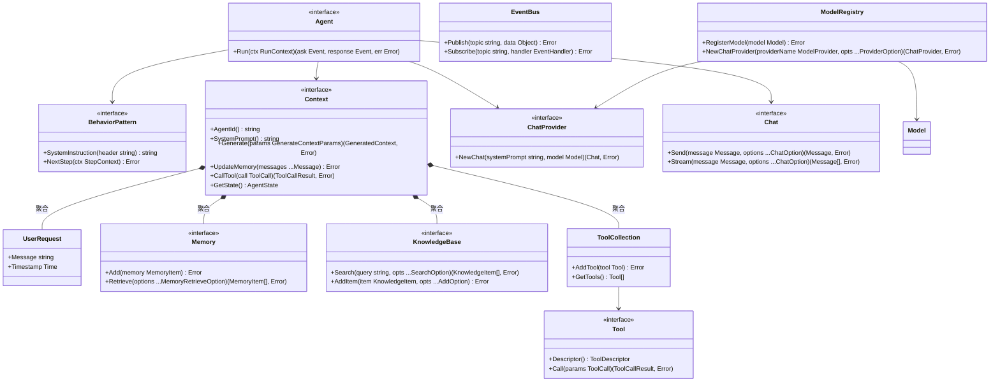
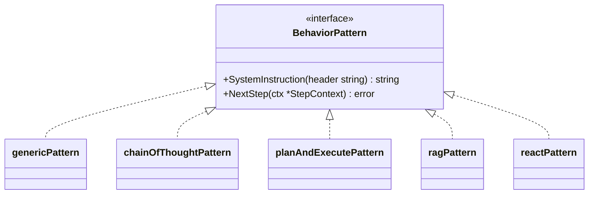
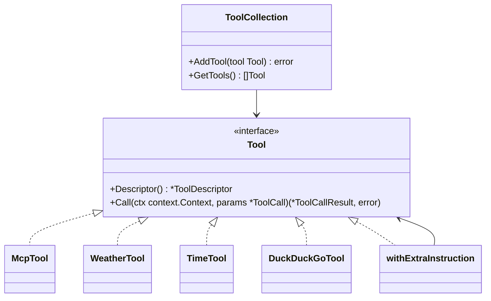
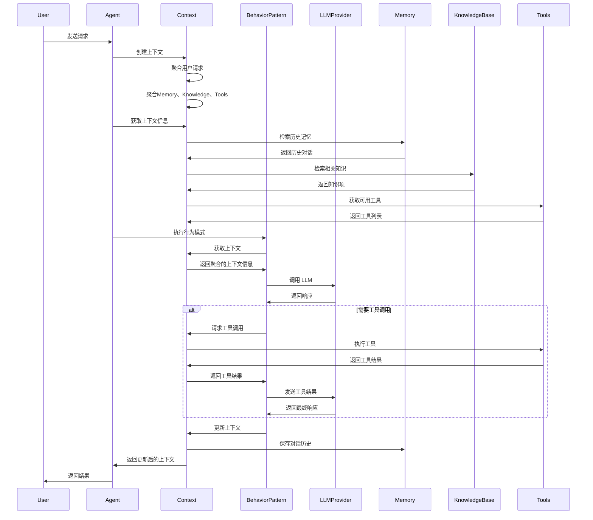
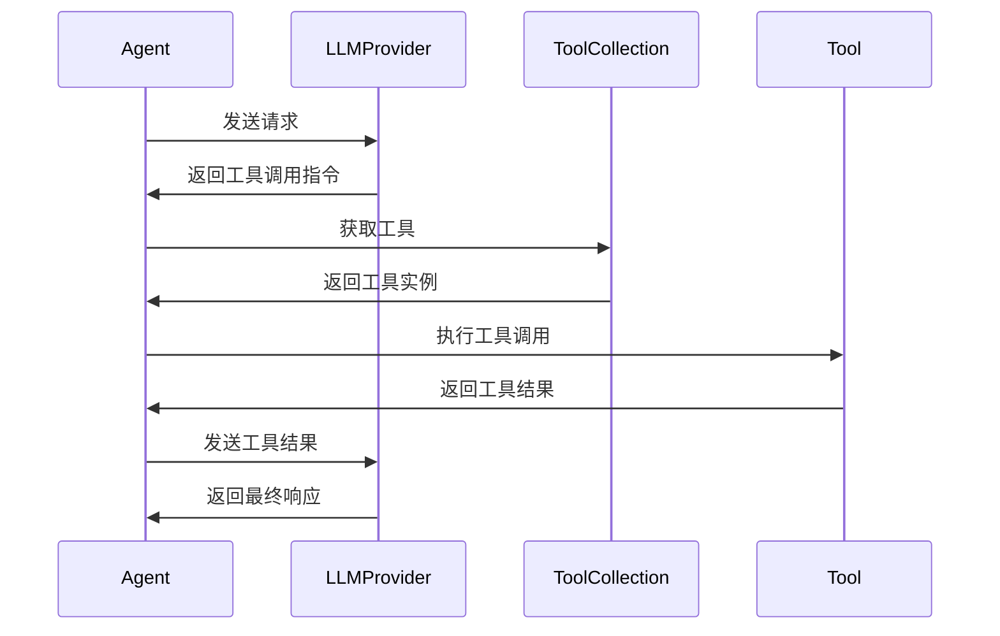
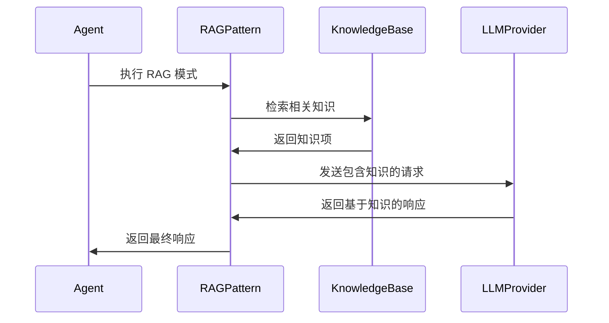

# Agent-Go 系统设计文档

## 1. 概述

Agent-Go 是一个基于 Go 语言实现的 LLM Agent 框架，支持多种大模型提供商的统一调用、函数调用、流式对话等能力。该框架采用模块化设计，提供了灵活的 Agent 行为模式、工具系统、知识库管理和内存管理等功能。

### 1.1 核心特性

- **多提供商支持**: OpenAI、Anthropic、Gemini 和 OpenAI 兼容 API
- **统一接口**: 工厂模式，便于提供商注册和扩展
- **函数调用**: 支持自定义工具和函数调用
- **流式对话**: 实时流式传输和多轮上下文管理
- **行为模式**: 支持多种推理模式（Generic、Chain of Thought、Plan and Execute、RAG、ReAct）
- **知识管理**: 支持向量数据库存储和检索
- **内存管理**: 支持对话历史和状态管理
- **MCP 集成**: 支持 Model Context Protocol 工具集成

## 2. 核心架构

### 2.1 整体架构图

```
┌──────────────────────────────────────────────────────────────┐
│                        应用层 (Application Layer)             │
├──────────────────────────────────────────────────────────────┤
│  Chat Demo  │  CLI Tools  │  Custom Apps  │  MCP Integration │
└──────────────────────────────────────────────────────────────┘
                              │
┌──────────────────────────────────────────────────────────────┐
│                       框架层 (Framework Layer)                │
├──────────────────────────────────────────────────────────────┤
│                        核心域 (Core Domain)                   │
├──────────────────────────────────────────────────────────────┤
│    Agent    │   Context   │  Behavior    │   Memory          │
│             │             │  Patterns    │                   │
├──────────────────────────────────────────────────────────────┤
│   Tools     │ Knowledge   │    State     │   Events          │
│             │             │              │                   │
└──────────────────────────────────────────────────────────────┘
                              │
┌──────────────────────────────────────────────────────────────┐
│                       支撑域 (Supporting Domain)              │
├──────────────────────────────────────────────────────────────┤
│    LLMs     │  Document   │  Embedder    │  VectorDB         │
│  Providers  │             │              │                   │
├──────────────────────────────────────────────────────────────┤
│  EventBus   │  Journal    │   MCP        │   Streaming       │
└──────────────────────────────────────────────────────────────┘
                              │
┌──────────────────────────────────────────────────────────────┐
│                       通用域 (Generic Domain)                 │
├──────────────────────────────────────────────────────────────┤
│   Utils     │  Commons    │  Errors      │   Config          │
│             │             │              │                   │
├──────────────────────────────────────────────────────────────┤
│  Retry      │  HTTP       │  Math        │   Strings         │
└──────────────────────────────────────────────────────────────┘
```

**架构说明：**

- **应用层**: 基于框架构建的具体应用，包括聊天演示、CLI工具、自定义应用和MCP集成
- **核心域**: 框架的核心业务逻辑，包含Agent、上下文管理、行为模式、内存管理等核心功能
- **支撑域**: 为核心域提供支撑服务，包括LLM提供商、文档处理、向量数据库、事件总线等
- **通用域**: 提供通用的基础设施服务，包括工具类、错误处理、配置管理等

### 2.2 系统类图



**核心实现类列表：**
- **Agent**: `genericAgent`
- **BehaviorPattern**: `genericPattern`, `chainOfThoughtPattern`, `planAndExecutePattern`, `ragPattern`, `reactPattern`
- **Context**: `ruleBaseContext`
- **Tool**: `McpTool`, `WeatherTool`, `TimeTool`, `DuckDuckGoTool`, `withExtraInstruction`
- **Memory**: `inMemoryMemory`
- **KnowledgeBase**: `baseKnowledge`
- **ChatProvider**: `OpenAIChatProvider`, `AnthropicChatProvider`, `GeminiChatProvider`
- **Chat**: 各提供商的具体实现
- **EventBus**: `eventBus`
- **ToolCollection**: `toolCollection`
- **ModelRegistry**: `registry`

### 2.3 行为模式类图



**行为模式实现类：**
- `genericPattern`: 通用对话模式
- `chainOfThoughtPattern`: 思维链推理模式
- `planAndExecutePattern`: 计划执行模式
- `ragPattern`: 检索增强生成模式
- `reactPattern`: ReAct 推理模式

### 2.4 工具系统类图



**工具实现类：**
- `McpTool`: MCP 协议工具
- `WeatherTool`: 天气查询工具
- `TimeTool`: 时间查询工具
- `DuckDuckGoTool`: 搜索工具
- `withExtraInstruction`: 工具装饰器

## 3. 核心流程

### 3.1 Agent 运行序列图



### 3.2 工具调用序列图



### 3.3 知识检索序列图



## 4. 设计要点

1. **模块化设计**: 核心组件通过接口解耦，便于扩展和测试
2. **事件驱动**: 使用事件总线实现组件间的松耦合通信
3. **工厂模式**: 通过工厂模式管理模型提供商的注册和创建
4. **策略模式**: 行为模式采用策略模式，支持不同的 Agent 推理方式
5. **组合模式**: 工具系统支持工具的组合和装饰
6. **流式处理**: 支持流式对话，提供实时响应体验

## 5. 扩展性

- **新的行为模式**: 实现 `BehaviorPattern` 接口即可添加新的推理模式
- **新的工具**: 实现 `Tool` 接口即可添加新的工具功能
- **新的模型提供商**: 实现 `ChatProvider` 接口并通过工厂注册
- **新的知识库**: 实现 `KnowledgeBase` 接口即可添加新的知识存储方式
- **新的内存管理**: 实现 `Memory` 接口即可添加新的记忆存储方式

## 6. 总结

Agent-Go 系统采用分层架构设计，通过核心域、支撑域和通用域的清晰划分，实现了高内聚、低耦合的系统结构。核心设计原则包括模块化、事件驱动、工厂模式等，确保了系统的可扩展性和可维护性。

系统支持多种行为模式，包括通用对话、思维链推理、计划执行、RAG 和 ReAct 等，能够适应不同的应用场景。通过统一的接口设计和事件驱动机制，系统具有良好的扩展性，可以方便地集成新的模型提供商、工具和知识库。

整体架构遵循了领域驱动设计的思想，通过清晰的边界和职责分离，为构建复杂的 AI Agent 应用提供了坚实的基础。
