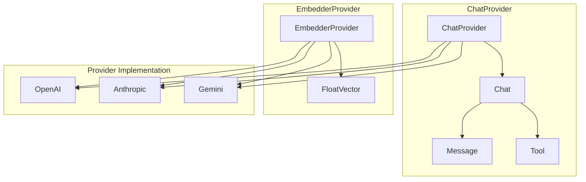
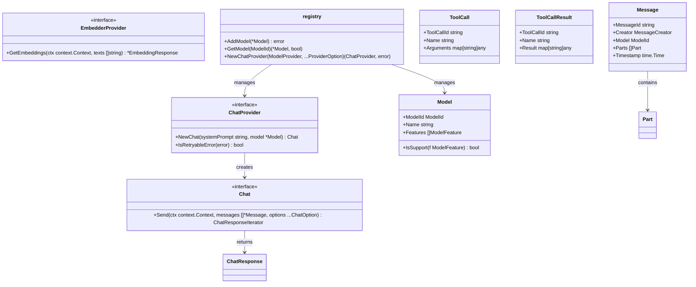
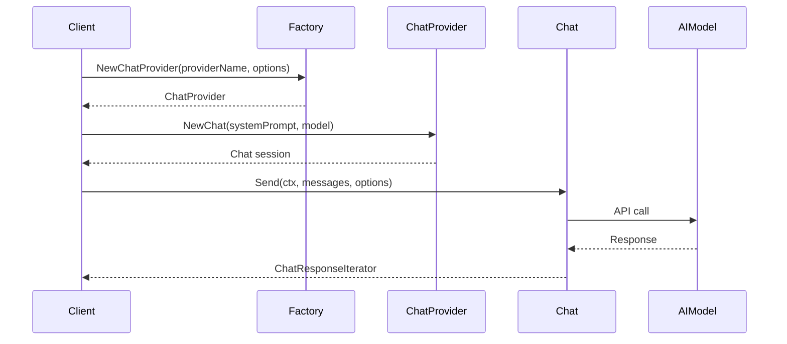
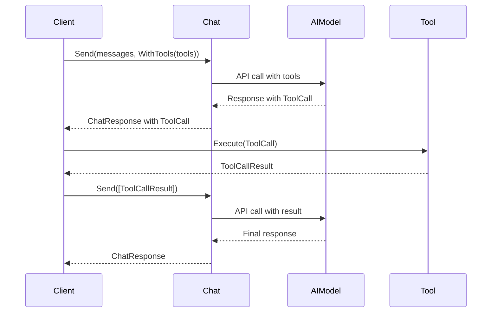

# LLMs 模块概要设计

## 概述

LLMs模块是agent-go框架的AI模型提供商抽象层，提供统一的接口支持多种AI服务提供商（OpenAI、Anthropic、Gemini等）。

## 整体架构图



**架构说明：**

- **ChatProvider 子图**: ChatProvider创建Chat对象，Chat使用Message进行消息传递，使用Tool进行工具调用
- **EmbedderProvider 子图**: EmbedderProvider使用FloatVector进行向量嵌入
- **提供商实现**: OpenAI、Anthropic、Gemini等具体实现

## 核心类图



## 核心序列图

### 聊天对话流程



### 工具调用流程



## 核心数据结构

### 消息系统
```go
type Message struct {
    MessageId string         // 消息唯一标识
    Creator   MessageCreator // 创建者信息
    Model     ModelId        // 使用的模型
    Parts     []Part         // 消息内容部分
    Timestamp time.Time      // 创建时间
}

type MessageRole string
const (
    MessageRoleSystem    MessageRole = "system"
    MessageRoleUser      MessageRole = "user" 
    MessageRoleAssistant MessageRole = "assistant"
    MessageRoleTool      MessageRole = "tool"
)
```

### 模型系统
```go
type ModelId struct {
    Provider ModelProvider // 提供商
    ID       string        // 模型ID
}

type Model struct {
    ModelId            // 嵌入模型标识
    Name               string         // 显示名称
    Features           []ModelFeature // 支持的特性
}

type ModelFeature string
const (
    ModelFeatureCompletion ModelFeature = "can_completion"
    ModelFeatureEmbedding  ModelFeature = "can_embedding"
    ModelFeatureReasoning  ModelFeature = "can_reason"
)
```

### 工具系统
```go
type ToolDescriptor struct {
    Name        string  // 工具名称
    Description string  // 工具描述
    Parameters  *Schema // 参数模式
}

type ToolCall struct {
    ToolCallId string         // 调用ID
    Name       string         // 工具名称
    Arguments  map[string]any // 参数
}

type ToolCallResult struct {
    ToolCallId string         // 调用ID
    Name       string         // 工具名称
    Result     map[string]any // 结果数据
}
```

## 核心接口

### ChatProvider 接口
```go
type ChatProvider interface {
    io.Closer
    
    // 创建新的聊天会话
    NewChat(systemPrompt string, model *Model) (Chat, error)
    
    // 判断错误是否可重试
    IsRetryableError(error) bool
}
```

### Chat 接口
```go
type Chat interface {
    // 发送消息并获取响应迭代器
    Send(ctx context.Context, messages []*Message, options ...ChatOption) (ChatResponseIterator, error)
}
```

### EmbedderProvider 接口
```go
type EmbedderProvider interface {
    // 生成文本嵌入向量
    GetEmbeddings(ctx context.Context, texts []string) (*EmbeddingResponse, error)
}
```

## 工厂模式

### 注册机制
```go
// 注册聊天提供商
func RegisterChatProvider(providerName ModelProvider, constructor ChatProviderConstructor) error

// 注册模型
func RegisterModel(model *Model) error
```

### 实例化
```go
// 创建聊天提供商实例
func NewChatProvider(providerName ModelProvider, opts ...ProviderOption) (ChatProvider, error)

// 获取模型配置
func GetModel(modelId ModelId) (*Model, bool)
```

## 配置选项

### ProviderOptions
```go
type ProviderOptions struct {
    BaseUrl                 string // API基础URL
    ApiKey                  string // API密钥
    SkipVerifySSL           bool   // 跳过SSL验证
    Debug                   bool   // 调试模式
}
```

### ChatOptions
```go
type ChatOptions struct {
    Temperature           *float64        // 采样温度
    MaxCompletionTokens  *int64          // 最大完成token数
    Tools                []*ToolDescriptor // 可用工具
    Streaming            bool            // 流式响应
}
```

## 实现提供商

### 支持的提供商
1. **OpenAI** - GPT系列模型支持
2. **Anthropic** - Claude系列模型支持  
3. **Gemini** - Google Gemini模型支持

## 设计模式

1. **工厂模式** - 通过注册表管理提供商实例化
2. **策略模式** - 不同提供商实现相同接口
3. **迭代器模式** - 流式响应的处理

## 扩展性

- 新增AI提供商只需实现相应接口并注册
- 支持自定义模型配置和特性
- 可扩展的工具调用系统

## 总结

LLM Provider 模块通过统一的接口设计，实现了对多个 AI 提供商的抽象和统一管理。核心设计采用工厂模式和策略模式，确保了系统的可扩展性和可维护性。

该模块提供了完整的聊天和嵌入功能支持，包括流式响应、工具调用、错误处理等特性。通过标准化的接口设计，开发者可以轻松集成新的 AI 提供商，同时保持与现有系统的兼容性。

模块的设计充分考虑了实际应用场景的需求，提供了灵活的配置选项和错误处理机制，为上层应用提供了稳定可靠的 AI 服务基础。
