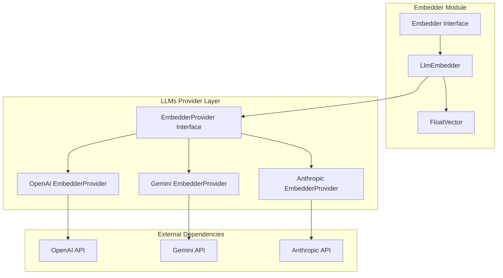
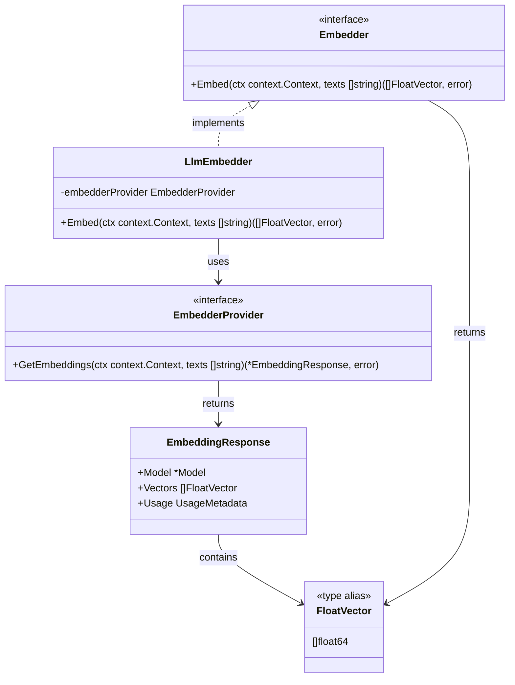
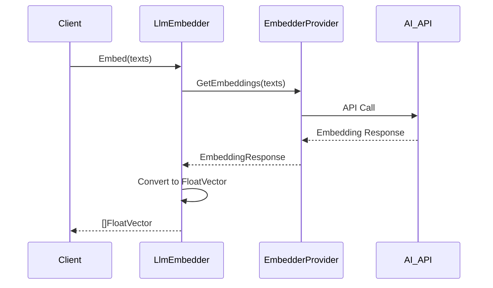
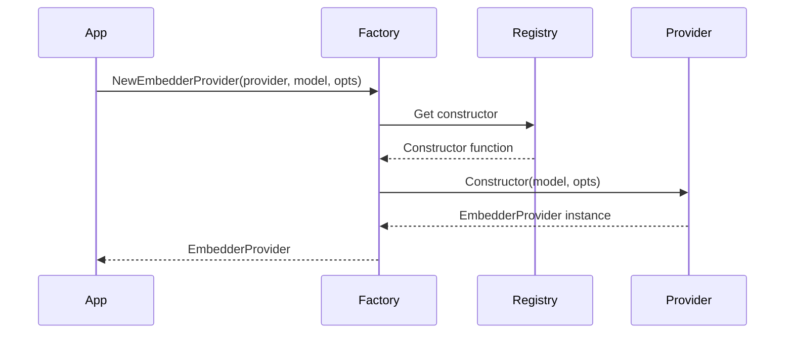

# Embedder 模块概要设计

## 概述

Embedder模块是agent-go框架的向量嵌入抽象层，为LLM EmbedderProvider提供统一封装。该模块将不同AI服务提供商的嵌入功能抽象为统一的接口，支持文本到向量的转换，为向量数据库和知识检索提供基础能力。

## 整体架构图



**架构说明：**

- **Embedder Module**: 提供统一的嵌入接口和实现
- **LLMs Provider Layer**: 底层AI服务提供商抽象层
- **External Dependencies**: 外部AI服务API

## 核心类图



**类说明：**

- **Embedder**: 核心嵌入接口，定义文本到向量的转换方法
- **FloatVector**: 向量数据类型，表示浮点数向量
- **LlmEmbedder**: 主要实现类，封装LLM EmbedderProvider
- **EmbedderProvider**: 底层提供商接口，由LLMs模块提供
- **EmbeddingResponse**: 嵌入响应结构，包含向量和元数据

## 核心序列图

### 1. 文本嵌入流程



### 2. 提供商注册流程



## 核心数据结构

### FloatVector
```go
type FloatVector []float64
```
- 表示浮点数向量
- 用于存储文本嵌入的数值表示
- 支持向量运算和相似度计算

### EmbeddingResponse
```go
type EmbeddingResponse struct {
    Model   *Model        // 使用的模型
    Vectors []FloatVector // 生成的向量
    Usage   UsageMetadata // 使用统计
}
```
- 封装嵌入操作的完整响应
- 包含模型信息、向量数据和使用统计

## 主要方法

### Embedder Interface
- **Embed(ctx, texts)**: 将文本数组转换为向量数组
  - 输入：上下文和文本数组
  - 输出：向量数组和错误信息

### LlmEmbedder
- **Embed(ctx, texts)**: 实现文本到向量的转换
  - 调用底层EmbedderProvider
  - 转换响应格式为统一接口

## 设计要点

1. **接口统一**: 所有嵌入提供商实现相同的接口规范
2. **类型安全**: 基于Schema的参数定义和运行时类型检查
3. **可扩展性**: 装饰器模式支持功能增强，模块化设计便于扩展
4. **上下文感知**: 支持上下文传递和取消，工具执行可被外部中断

## 总结

Embedder 模块提供了统一的文本嵌入功能抽象，支持多种 AI 提供商的嵌入服务。通过标准化的接口设计和工厂模式，实现了对不同嵌入服务的统一管理。

该模块的核心价值在于为知识库和 RAG 应用提供了可靠的向量化基础，支持批量处理和流式处理两种模式。通过 LLM 嵌入器的实现，充分利用了现有 LLM 提供商的嵌入能力，降低了系统复杂度。

模块设计注重实用性和扩展性，提供了灵活的配置选项和错误处理机制，为上层应用提供了稳定可靠的嵌入服务基础。
