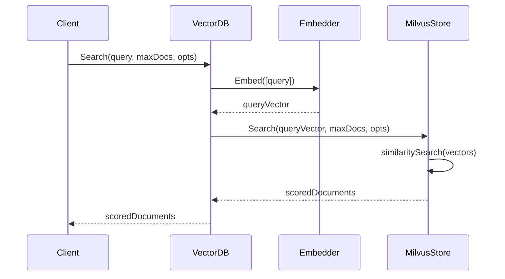

# 向量存储模块设计

## 概述

向量存储模块提供向量数据库功能，用于存储和检索文档，支持语义相似性搜索。该模块包含向量数据库接口定义和具体实现。

## 架构

向量存储模块采用分层架构模式：

1. **接口层**：定义向量数据库操作的核心接口
2. **实现层**：提供具体实现（如 Milvus）
3. **文档层**：定义文档数据结构和处理逻辑
4. **集成层**：与嵌入器模块连接以生成向量

## 整体框架


## 核心组件

### 1. 向量数据库接口

`VectorDB` 接口定义了向量数据库交互的核心操作：

```go
type VectorDB interface {
    AddDocuments(ctx context.Context, documents []*Document, opts ...InsertOption) ([]DocumentId, error)
    UpdateDocuments(ctx context.Context, documents []*Document, opts ...UpdateOption) error
    Search(ctx context.Context, query string, maxDocuments int, opts ...SearchOption) ([]*ScoredDocument, error)
    Get(ctx context.Context, documentId DocumentId) (*Document, error)
    Delete(ctx context.Context, documentId DocumentId) error
}
```

### 2. 文档模型

文档是存储在向量数据库中的主要数据结构：

```go
type Document struct {
    Id       DocumentId
    Name     string
    Metadata map[string]any
    Content  string
    Embedding FloatVector
}
```

### 3. 文档处理

文档模块提供文档读取和分块功能：

```go
type Reader interface {
    Read(ctx context.Context, source string) ([]*Document, error)
}

type Chunking interface {
    Chunk(documents []*Document) ([]*Document, error)
}
```

## 类图


## 序列图

### 文档添加流程


### 文档搜索流程



## 关键设计模式

### 1. 策略模式
- 不同的向量数据库实现（如 Milvus）都实现相同的 `VectorDB` 接口
- 嵌入器实现可以在不改变存储逻辑的情况下进行替换

### 2. 选项模式
- 使用函数式选项进行配置（InsertOptions, SearchOptions）
- 允许灵活的参数传递，无需复杂的构造函数

### 3. 工厂模式
- 向量数据库实例通过工厂函数创建
- 支持不同的配置和实现

## 配置选项

### 插入选项
```go
type InsertOptions interface {
    GetCollection() string
    GetEmbedder() Embedder
}
```

### 搜索选项
```go
type SearchOptions interface {
    GetCollection() string
    GetScoreThreshold() float32
    GetFilters() any
    GetEmbedder() Embedder
}
```

## 错误处理

模块定义了特定的错误类型：
- `ErrDocumentNotFound`：当请求的文档不存在时
- `ErrStorageRequired`：当存储配置缺失时
- `ErrEmbedderWrongNumberVectors`：当嵌入器输出与文档数量不匹配时

## 与嵌入器模块的集成

向量存储模块与嵌入器模块集成以生成向量表示：

1. **依赖关系**：向量存储依赖嵌入器进行向量生成
2. **接口**：使用 `Embedder` 接口进行抽象
3. **流程**：文档在存储前转换为向量，查询在搜索前向量化
4. **配置**：嵌入器通过选项配置，可以在操作间共享

## 实现类

### 核心实现
- `MilvusStore`：Milvus 向量数据库实现

### 配置
- `CollectionSchema`：Milvus 集合配置
- `MilvusInsertOptions`：Milvus 特定的插入选项
- `MilvusSearchOptions`：Milvus 特定的搜索选项

### 文档处理
- `Reader`：文档读取接口
- `Chunking`：文档分块接口
- `FixedChunking`：固定大小分块实现

## 性能考虑

1. **批量操作**：支持批量文档插入以提高性能
2. **异步操作**：Milvus 实现支持异步索引创建
3. **连接池**：Milvus 客户端管理连接池
4. **缓存**：集合模式在内存中缓存
5. **并发**：线程安全操作，具有适当的锁定机制

## 安全考虑

1. **身份验证**：Milvus 客户端支持用户名/密码身份验证
2. **集合隔离**：不同的集合提供数据隔离
3. **输入验证**：验证文档内容和元数据
4. **错误处理**：敏感信息不会在错误消息中暴露

## 设计要点

1. **接口统一**: 所有向量数据库实现相同的接口规范
2. **类型安全**: 基于Schema的参数定义和运行时类型检查
3. **可扩展性**: 支持多种向量数据库后端，模块化设计便于扩展
4. **性能优化**: 支持批量操作和异步处理，提供高效的向量检索

## 总结

Vector Storage 模块提供了统一的向量数据库抽象，支持多种向量数据库后端的集成。通过标准化的接口设计，实现了对不同向量存储服务的统一管理。

该模块的核心价值在于为 RAG 应用和知识检索提供了可靠的向量存储基础，支持高效的相似度搜索和批量操作。通过 Milvus 等专业向量数据库的集成，提供了高性能的向量检索能力。

模块设计注重实用性和扩展性，提供了灵活的配置选项和错误处理机制，为上层应用提供了稳定可靠的向量存储服务基础。
