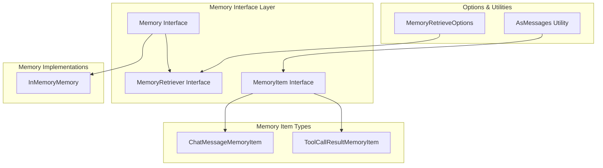

# Memory 模块设计文档

## 概述

Memory 模块是 agent-go 框架中的核心组件，负责管理 Agent 的对话历史和工具调用结果。它提供了统一的接口来存储、检索和管理不同类型的记忆项，支持 Agent 的上下文感知和持续对话能力。

## 核心架构



## 核心接口设计

### Memory 接口

Memory 接口是模块的核心，继承自 MemoryRetriever 并添加了写入和重置功能：

```go
type Memory interface {
    MemoryRetriever
    Add(ctx context.Context, memory MemoryItem) error
    Reset() error
}
```

### MemoryRetriever 接口

提供记忆检索功能，支持灵活的查询选项：

```go
type MemoryRetriever interface {
    Retrieve(ctx context.Context, options ...MemoryRetrieveOption) ([]MemoryItem, error)
}
```

### MemoryItem 接口

定义记忆项的标准结构，支持转换为 LLM 消息：

```go
type MemoryItem interface {
    GetId() MemoryItemId
    GetContent() any
    GetCreatedAt() time.Time
    AsMessage() (*llms.Message, bool)
}
```

## 核心数据结构

### MemoryItemId
```go
type MemoryItemId string
```
记忆项的唯一标识符，使用 UUID 生成。

### MemoryRetrieveOptions
```go
type MemoryRetrieveOptions struct {
    Limit int `json:"limit"`  // 检索数量限制，-1 表示无限制
}
```

### ChatMessageMemoryItem
存储对话消息的记忆项：
```go
type ChatMessageMemoryItem struct {
    memoryId MemoryItemId
    message  *llms.Message
}
```

### ToolCallResultMemoryItem
存储工具调用结果的记忆项：
```go
type ToolCallResultMemoryItem struct {
    memoryId  MemoryItemId
    result    *llms.ToolCallResult
    timestamp time.Time
}
```

## 实现类

### InMemoryMemory

基于内存的 Memory 实现，使用切片存储记忆项：

```go
type InMemoryMemory struct {
    items []MemoryItem
}
```

**核心方法：**
- `Add()`: 添加新的记忆项到切片末尾
- `Retrieve()`: 根据限制条件返回记忆项
- `Reset()`: 清空所有记忆项

## 工具函数

### 记忆项创建
- `NewChatMessageMemoryItem()`: 创建对话消息记忆项
- `NewToolCallResultMemoryItem()`: 创建工具调用结果记忆项

### 记忆项检索选项
- `WithNoLimit()`: 设置无限制检索
- `WithMaxLimit(limit int)`: 设置最大检索数量

### 类型转换
- `AsMessages()`: 将记忆项数组转换为 LLM 消息数组

## 使用示例

### 基本使用
```go
// 创建内存记忆实例
memory := NewInMemoryMemory()

// 添加对话消息
message := llms.NewUserMessage("Hello")
memoryItem := NewChatMessageMemoryItem(message)
memory.Add(ctx, memoryItem)

// 检索记忆
items, err := memory.Retrieve(ctx, WithMaxLimit(10))
```

### 工具调用结果存储
```go
// 存储工具调用结果
result := &llms.ToolCallResult{...}
toolMemoryItem := NewToolCallResultMemoryItem(result)
memory.Add(ctx, toolMemoryItem)

// 转换为消息格式
messages := AsMessages(items)
```

## 设计要点

1. **接口统一**: 所有内存实现相同的接口规范
2. **类型安全**: 基于Schema的参数定义和运行时类型检查
3. **可扩展性**: 支持多种内存存储后端，模块化设计便于扩展
4. **性能优化**: 支持批量操作和异步处理，提供高效的内存检索

## 总结

Memory 模块提供了统一的记忆管理抽象，支持多种内存存储后端的集成。通过标准化的接口设计，实现了对不同记忆存储服务的统一管理。

该模块的核心价值在于为 Agent 提供了持久化的记忆能力，支持对话历史、状态信息等数据的存储和检索。通过内存工具的支持，Agent 可以主动管理自己的记忆，实现更智能的对话体验。

模块设计注重实用性和扩展性，提供了灵活的配置选项和错误处理机制，为上层应用提供了稳定可靠的记忆管理服务基础。
