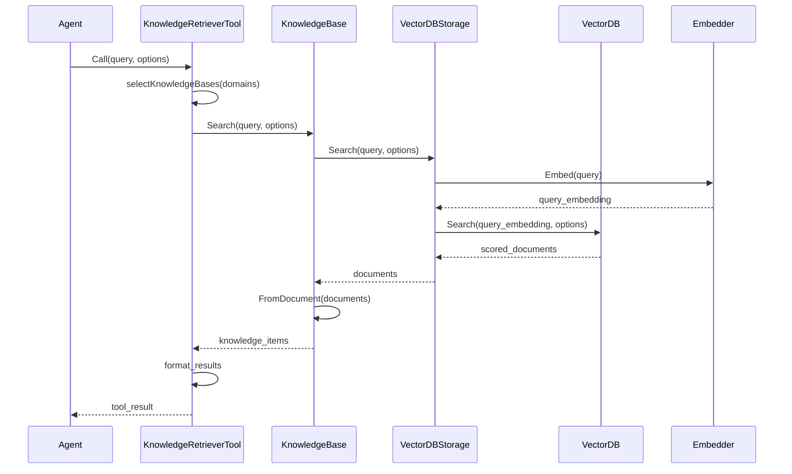
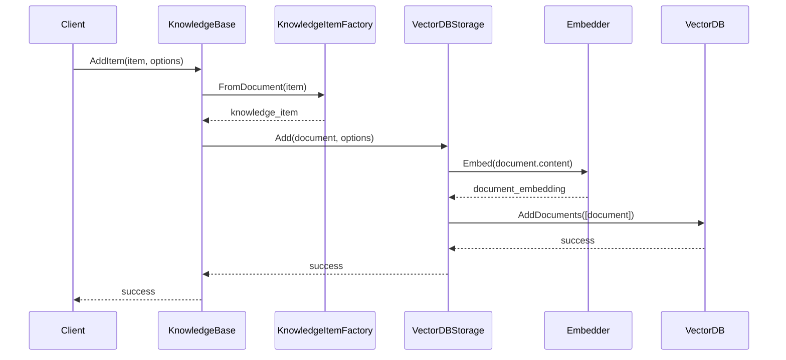

# Knowledge 模块设计文档

## 概述

Knowledge 模块是 agent-go 框架中的知识管理核心组件，提供了完整的知识库管理功能，包括知识的存储、检索、更新和管理。该模块采用向量数据库作为底层存储，支持语义搜索和相似度匹配。

### 主要功能
- **知识存储**：支持向量化存储，基于向量数据库实现高效检索
- **语义搜索**：集成嵌入模型，支持语义相似度搜索
- **知识管理**：提供完整的 CRUD 操作和元数据管理
- **工具集成**：将知识库功能包装为工具供 Agent 使用
- **多知识库**：支持多个知识库的管理和查询

## 整体架构

```
┌────────────────────────────────────────────────────────────────────────────┐
│                           Knowledge Module Architecture                    │
├────────────────────────────────────────────────────────────────────────────┤
│                                                                            │
│  ┌─────────────────────────────────────────────────────────────────────┐   │
│  │                    KnowledgeRetrieverToolWrapper                    │   │
│  │                                                                     │   │
│  │  • Wraps knowledge retrieval as Agent tools                         │   │
│  │  • Manages multiple knowledge bases                                 │   │
│  │  • Implements selection strategies                                  │   │
│  └─────────────────────────────────────────────────────────────────────┘   │
│                                    │                                       │
│                                    ▼                                       │
│  ┌───────────────────────────────────────────────────────────────────────┐ │
│  │                           KnowledgeBase                               │ │
│  │                                                                       │ │
│  │  ┌───────────────────┐  ┌─────────────────┐  ┌─────────────────────┐  │ │
│  │  │KnowledgeRetriever │  │KnowledgeUpdater │  │ KnowledgeManager    │  │ │
│  │  │                   │  │                 │  │                     │  │ │
│  │  │• Search()         │  │• AddItem()      │  │• GetMetadata()      │  │ │
│  │  │• Semantic query   │  │• UpdateItem()   │  │• UpdateMetadata()   │  │ │
│  │  │• Similarity       │  │• CRUD operations│  │• GetItem()          │  │ │
│  │  │  matching         │  │                 │  │• DeleteItem()       │  │ │
│  │  └───────────────────┘  └─────────────────┘  └─────────────────────┘  │ │
│  └───────────────────────────────────────────────────────────────────────┘ │
│                                    │                                       │
│                                    ▼                                       │
│  ┌─────────────────────────────────────────────────────────────────────┐   │
│  │                        KnowledgeStorage                             │   │
│  │                                                                     │   │
│  │  ┌─────────────────────────────────────────────────────────────┐    │   │
│  │  │                    VectorDBStorage                          │    │   │
│  │  │                                                             │    │   │
│  │  │  • Vector database operations                               │    │   │
│  │  │  • Embedding generation                                     │    │   │
│  │  │  • Similarity search                                        │    │   │
│  │  │  • Document CRUD                                            │    │   │
│  │  └─────────────────────────────────────────────────────────────┘    │   │
│  └─────────────────────────────────────────────────────────────────────┘   │
│                                    │                                       │
│                                    ▼                                       │
│  ┌─────────────────────────────────────────────────────────────────────┐   │
│  │                           KnowledgeItem                             │   │
│  │                                                                     │   │
│  │  • Represents individual knowledge units                            │   │
│  │  • Provides document conversion                                     │   │
│  │  • Manages metadata and timestamps                                  │   │
│  │  • Factory pattern for creation                                     │   │
│  └─────────────────────────────────────────────────────────────────────┘   │
│                                                                            │
└────────────────────────────────────────────────────────────────────────────┘
```

## 核心模块类图

```mermaid
classDiagram
    class KnowledgeBase {
        <<interface>>
        +Search(ctx, query, opts) []KnowledgeItem
        +AddItem(ctx, item, opts) error
        +UpdateItem(ctx, id, item, opts) error
        +GetMetadata() *KnowledgeBaseMetadata
        +UpdateMetadata(metadata) 
        +GetItem(ctx, id) KnowledgeItem
        +DeleteItem(ctx, id) error
    }

    class KnowledgeRetriever {
        <<interface>>
        +Search(ctx, query, opts) []KnowledgeItem
    }

    class KnowledgeUpdater {
        <<interface>>
        +AddItem(ctx, item, opts) error
        +UpdateItem(ctx, id, item, opts) error
    }

    class KnowledgeManager {
        <<interface>>
        +GetMetadata() *KnowledgeBaseMetadata
        +UpdateMetadata(metadata)
        +GetItem(ctx, id) KnowledgeItem
        +DeleteItem(ctx, id) error
    }

    class knowledgeBase {
        -storage KnowledgeStorage
        -factory KnowledgeItemFactory
        -metadata *KnowledgeBaseMetadata
        -mu sync.RWMutex
        +Search(ctx, query, opts) []KnowledgeItem
        +AddItem(ctx, item, opts) error
        +UpdateItem(ctx, id, item, opts) error
        +GetMetadata() *KnowledgeBaseMetadata
        +UpdateMetadata(metadata)
        +GetItem(ctx, id) KnowledgeItem
        +DeleteItem(ctx, id) error
    }

    class KnowledgeStorage {
        <<interface>>
        +Add(ctx, doc, opts) error
        +Update(ctx, id, doc, opts) error
        +Get(ctx, id) *Document
        +Delete(ctx, id) error
        +Search(ctx, query, opts) []*Document
    }

    class VectorDBStorage {
        -Collection string
        -vectorDB VectorDB
        -embedder Embedder
        +Add(ctx, doc, opts) error
        +Update(ctx, id, doc, opts) error
        +Get(ctx, id) *Document
        +Delete(ctx, id) error
        +Search(ctx, query, opts) []*Document
    }

    class KnowledgeItem {
        <<interface>>
        +GetId() DocumentId
        +GetCreatedAt() time.Time
        +GetUpdatedAt() time.Time
        +ToDocument() *Document
    }

    class baseKnowledgeItem {
        -id DocumentId
        -document *Document
        -createdAt time.Time
        -updatedAt time.Time
        +GetId() DocumentId
        +GetCreatedAt() time.Time
        +GetUpdatedAt() time.Time
        +ToDocument() *Document
        +UpdateDocument(doc *Document)
    }

    class KnowledgeItemFactory {
        <<interface>>
        +FromDocument(doc) KnowledgeItem
    }

    class BaseKnowledgeItemFactory {
        +FromDocument(doc) KnowledgeItem
        +NewKnowledgeItem(doc) KnowledgeItem
    }

    class KnowledgeRetrieverToolWrapper {
        -knowledgeBases []KnowledgeBase
        -strategy SelectionStrategy
        +toolName() string
        +Descriptor() *ToolDescriptor
        +Call(ctx, toolCall) *ToolCallResult
    }

    class SelectionStrategy {
        <<interface>>
        +Select(bases, domains) []KnowledgeBase
    }

    class MaxCountStrategy {
        -MaxCount int
        +Select(bases, domains) []KnowledgeBase
    }

    class KnowledgeBaseMetadata {
        +Name string
        +Description string
        +Domains []string
        +Tags map[string]string
    }

    class Document {
        +Id DocumentId
        +Name string
        +Metadata map[string]any
        +Content string
        +Embedding FloatVector
    }

    %% 接口继承关系
    KnowledgeBase --> KnowledgeRetriever
    KnowledgeBase --> KnowledgeUpdater
    KnowledgeBase --> KnowledgeManager

    %% 实现关系
    knowledgeBase ..|> KnowledgeBase
    knowledgeBase --> KnowledgeStorage
    knowledgeBase --> KnowledgeItemFactory

    %% 存储实现
    VectorDBStorage ..|> KnowledgeStorage
    VectorDBStorage --> VectorDB
    VectorDBStorage --> Embedder

    %% 知识项实现
    baseKnowledgeItem ..|> KnowledgeItem
    baseKnowledgeItem --> Document

    %% 工厂实现
    BaseKnowledgeItemFactory ..|> KnowledgeItemFactory

    %% 工具包装器
    KnowledgeRetrieverToolWrapper --> KnowledgeBase
    KnowledgeRetrieverToolWrapper --> SelectionStrategy
    MaxCountStrategy ..|> SelectionStrategy

    %% 元数据
    knowledgeBase --> KnowledgeBaseMetadata
    baseKnowledgeItem --> Document
```



## 序列图

### 知识检索序列图



### 知识添加序列图



## 核心模块接口设计

### 1. KnowledgeBase 接口

KnowledgeBase 是知识库的核心接口，集成了检索、更新和管理功能：

```go
type KnowledgeBase interface {
    KnowledgeRetriever
    KnowledgeUpdater
    KnowledgeManager
}
```

#### 检索功能 (KnowledgeRetriever)
```go
// 语义搜索知识库
Search(ctx context.Context, query string, opts ...SearchOption) ([]KnowledgeItem, error)
```

#### 更新功能 (KnowledgeUpdater)
```go
// 添加知识项
AddItem(ctx context.Context, item KnowledgeItem, opts ...AddOption) error

// 更新知识项
UpdateItem(ctx context.Context, id document.DocumentId, item KnowledgeItem, opts ...UpdateOption) error
```

#### 管理功能 (KnowledgeManager)
```go
// 获取元数据
GetMetadata() *KnowledgeBaseMetadata

// 更新元数据
UpdateMetadata(metadata *KnowledgeBaseMetadata)

// 获取指定知识项
GetItem(ctx context.Context, id document.DocumentId) (KnowledgeItem, error)

// 删除知识项
DeleteItem(ctx context.Context, id document.DocumentId) error
```

### 2. KnowledgeStorage 接口

知识存储接口，专门处理 Document 的存储操作：

```go
type KnowledgeStorage interface {
    Add(ctx context.Context, doc *document.Document, opts ...AddOption) error
    Update(ctx context.Context, id document.DocumentId, doc *document.Document, opts ...UpdateOption) error
    Get(ctx context.Context, id document.DocumentId) (*document.Document, error)
    Delete(ctx context.Context, id document.DocumentId) error
    Search(ctx context.Context, query string, opts ...SearchOption) ([]*document.Document, error)
}
```

### 3. KnowledgeItem 接口

知识项接口，表示知识库中的单个知识单元：

```go
type KnowledgeItem interface {
    GetId() document.DocumentId
    GetCreatedAt() time.Time
    GetUpdatedAt() time.Time
    ToDocument() *document.Document
}
```

### 4. 核心数据结构

#### KnowledgeBaseMetadata
```go
type KnowledgeBaseMetadata struct {
    Name        string            `json:"name"`        // 知识库名称
    Description string            `json:"description"` // 知识库描述
    Domains     []string          `json:"domains"`     // 知识领域
    Tags        map[string]string `json:"tags"`        // 标签信息
}
```

#### Document
```go
type Document struct {
    Id       DocumentId         `json:"id"`       // 文档ID
    Name     string             `json:"name"`     // 文档名称
    Metadata map[string]any     `json:"metadata"` // 元数据
    Content  string             `json:"content"`  // 文档内容
    Embedding embedder.FloatVector `json:"_"`     // 向量表示
}
```

#### 配置选项
```go
// 搜索配置
type SearchOptions struct {
    MaxResults     int     // 最大结果数
    ScoreThreshold float32 // 相似度阈值
    Filters        any     // 过滤条件
}

// 添加配置
type AddOptions struct {
    Overwrite bool // 是否覆盖
}
```

## 设计要点

1. **接口统一**: 所有知识库实现相同的接口规范
2. **类型安全**: 基于Schema的参数定义和运行时类型检查
3. **可扩展性**: 支持多种知识存储后端，模块化设计便于扩展
4. **性能优化**: 支持批量操作和异步处理，提供高效的知识检索

## 总结

Knowledge 模块提供了统一的知识库管理抽象，支持多种知识存储后端的集成。通过标准化的接口设计，实现了对不同知识存储服务的统一管理。

该模块的核心价值在于为 RAG 应用提供了可靠的知识检索基础，支持语义搜索和相似度匹配。通过向量数据库的集成，提供了高性能的知识检索能力，为 Agent 的智能问答提供了强大的知识支持。

模块设计注重实用性和扩展性，提供了灵活的配置选项和错误处理机制，为上层应用提供了稳定可靠的知识库管理服务基础。
