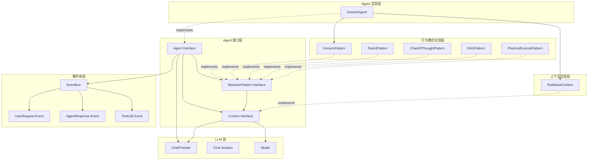
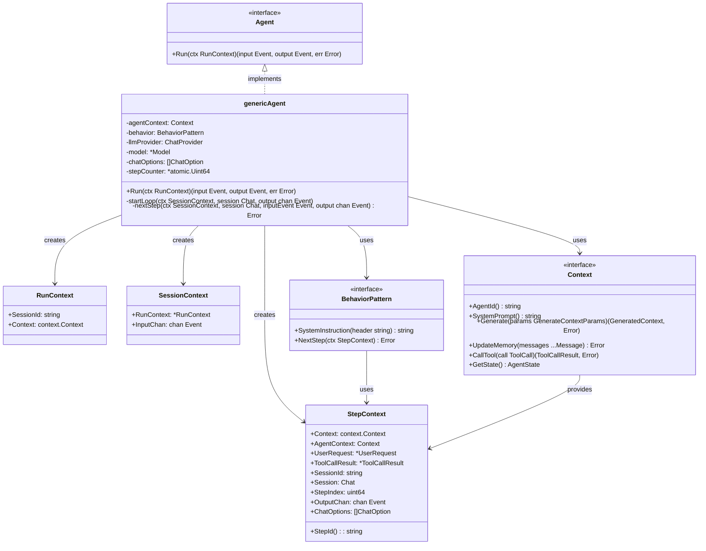
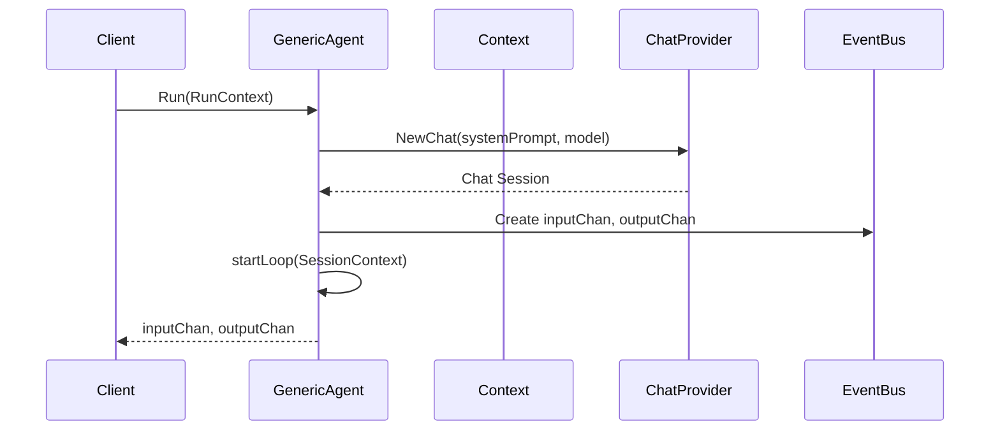
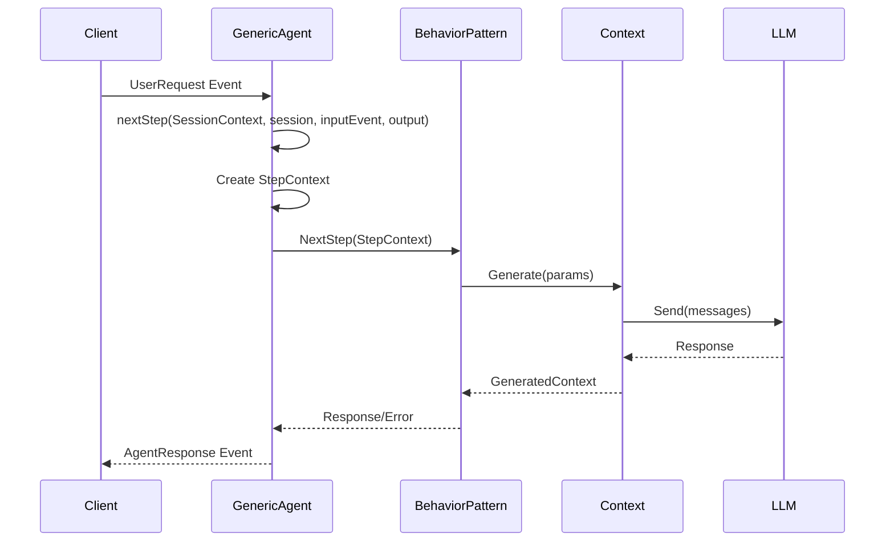
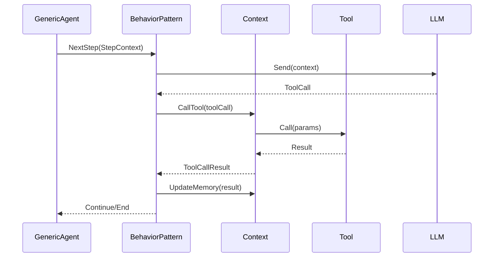
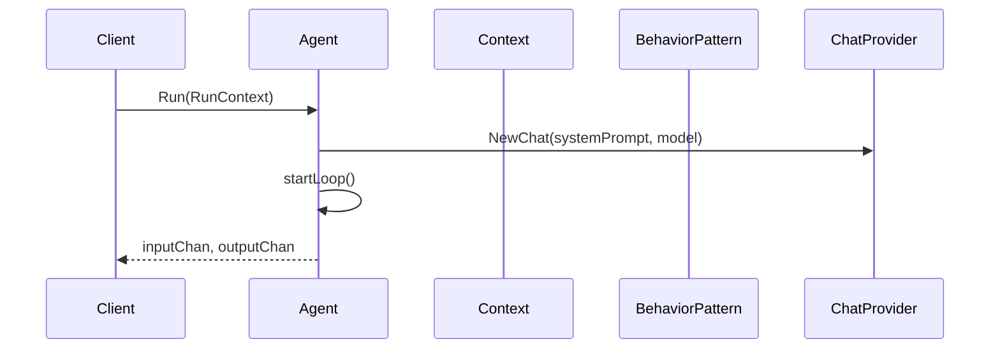
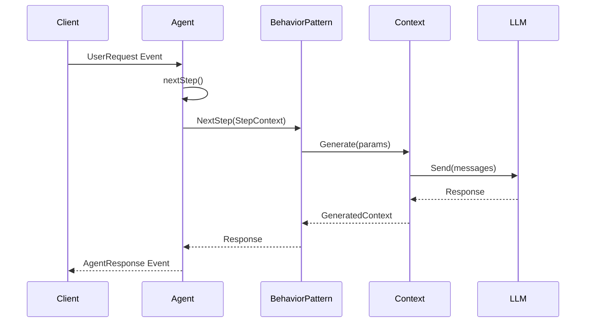
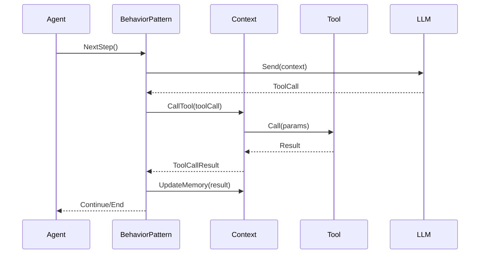
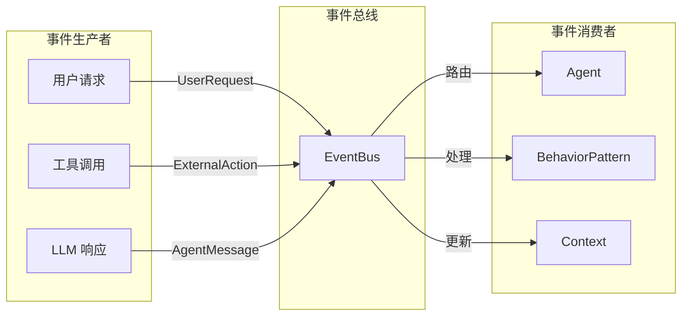
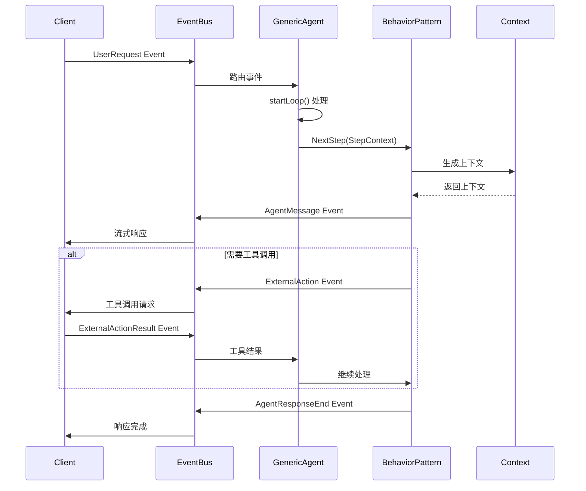

# Agent 模块整体设计

## 概述

Agent 模块是系统的核心组件，负责协调 LLM 模型、行为模式、上下文管理和事件处理，实现智能代理的核心功能。Agent 采用事件驱动的架构，通过行为模式（Behavior Pattern）来定义不同的推理和执行策略。

## 核心架构



## 核心组件关系

### 1. Agent 与 BehaviorPattern

Agent 通过行为模式来定义不同的推理和执行策略：

- **Agent** 负责整体流程控制和事件处理
- **BehaviorPattern** 定义具体的推理逻辑和步骤执行
- 每个 Agent 实例绑定一个特定的行为模式
- 行为模式通过 `NextStep()` 方法处理每个执行步骤

### 2. Agent 与 Context

Agent 通过 Context 获取执行所需的所有资源和信息：

- **Agent** 将 Context 作为执行环境的核心组件
- **Context** 提供系统提示词、模型、内存、状态、知识库和工具等资源
- Context 负责生成适合 LLM 处理的上下文信息
- Agent 通过 Context 调用工具和管理状态

### 3. BehaviorPattern 与 Context

行为模式通过 Context 访问执行资源：

- **BehaviorPattern** 在 `NextStep()` 中通过 Context 生成上下文
- **Context** 提供内存检索、工具调用、知识库查询等功能
- 行为模式通过 Context 与 LLM 进行交互

## GenericAgent 设计

GenericAgent 是 Agent 接口的核心实现，负责协调 LLM 模型、行为模式和上下文管理，实现智能代理的核心功能。它采用事件驱动的架构，通过异步消息处理循环来响应外部请求，支持流式响应和工具调用。GenericAgent 通过 StepContext 管理每个执行步骤的状态，使用原子计数器确保步骤的唯一性和可追踪性，同时提供统一的错误处理机制。

### 类图



### 核心方法序列图

#### 1. Agent 启动序列



#### 2. 事件处理序列



#### 3. 工具调用序列



### 设计特点

#### 1. 事件驱动循环
- `startLoop()` 方法实现事件驱动的消息处理循环
- 支持异步事件处理和流式响应
- 通过 channel 实现非阻塞的事件传递

#### 2. 步骤管理
- 使用原子计数器 `stepCounter` 管理执行步骤
- 每个步骤都有唯一的 `StepId` 用于追踪
- 支持步骤级别的上下文传递

#### 3. 上下文传递
- `StepContext` 封装了单步执行所需的所有信息
- 支持用户请求和工具调用结果的传递
- 提供统一的输出通道用于事件发布

#### 4. 错误处理
- 统一的错误处理机制
- 支持会话取消和异常恢复
- 错误信息通过事件系统传递

## 核心数据结构

### Agent 接口

```go
type Agent interface {
    Run(ctx *RunContext) (ask chan<- *eventbus.Event, response <-chan *eventbus.Event, err error)
}
```

### BehaviorPattern 接口

```go
type BehaviorPattern interface {
    SystemInstruction(header string) string
    NextStep(ctx *StepContext) error
}
```

### 核心上下文结构

```go
type StepContext struct {
    Context      context.Context
    AgentContext Context
    
    UserRequest    *UserRequest
    ToolCallResult *llms.ToolCallResult
    
    SessionId string
    Session   llms.Chat
    StepIndex uint64
    
    OutputChan  chan<- *eventbus.Event
    ChatOptions []llms.ChatOption
}
```

## 执行流程

### 1. Agent 启动流程



### 2. 事件处理流程



### 3. 工具调用流程



## 事件驱动架构

### 事件驱动设计

Agent 采用事件驱动架构，通过异步事件处理实现非阻塞的消息传递和响应。整个系统围绕事件总线（EventBus）构建，支持事件的发布、订阅和路由。



### 核心事件类型

#### 输入事件
- **UserRequest**: 用户请求事件，包含用户消息和选项
- **ExternalActionResult**: 外部动作结果事件，包含工具调用结果

#### 输出事件
- **AgentMessage**: Agent 消息事件，包含 LLM 生成的响应
- **ExternalAction**: 外部动作事件，包含工具调用请求
- **AgentResponseStart**: Agent 响应开始事件，标记响应开始
- **AgentResponseEnd**: Agent 响应结束事件，标记响应完成

### 事件处理流程



### 事件驱动优势

#### 1. 异步处理
- 支持非阻塞的事件处理
- 允许多个事件并发处理
- 提高系统响应性能

#### 2. 解耦合设计
- 事件生产者与消费者解耦
- 支持动态的事件路由
- 便于扩展新的事件类型

#### 3. 流式响应
- 支持实时的事件流处理
- 实现渐进式响应生成
- 提供更好的用户体验

#### 4. 错误隔离
- 单个事件处理失败不影响整体
- 支持事件级别的错误恢复
- 提供细粒度的错误处理

## 行为模式实现

系统提供多种行为模式实现：

- **GenericPattern**: 通用对话模式，适用于简单问答
- **ReActPattern**: ReAct 推理模式，支持工具调用和推理
- **ChainOfThoughtPattern**: 思维链模式，支持逐步推理
- **RAGPattern**: 检索增强生成模式，支持知识库查询
- **PlanAndExecutePattern**: 计划执行模式，支持任务分解

## 设计要点

1. **模块化设计**: Agent、Context、BehaviorPattern 职责分离
2. **事件驱动**: 异步事件处理机制，支持流式响应
3. **上下文管理**: 统一的上下文生成机制，支持内存、状态、知识库集成
4. **可扩展性**: 接口化设计，易于扩展，支持自定义行为模式

## 总结

Agent 整体架构采用模块化设计，通过清晰的职责分离和事件驱动机制，实现了高内聚、低耦合的系统结构。核心组件包括 Agent、Context、BehaviorPattern 等，通过统一的接口设计实现了良好的可扩展性。

系统支持多种行为模式，包括通用对话、思维链推理、计划执行、RAG 和 ReAct 等，能够适应不同的应用场景。通过事件总线机制，实现了异步处理和流式响应，提供了良好的用户体验。

整体架构遵循了领域驱动设计的思想，通过清晰的边界和职责分离，为构建复杂的 AI Agent 应用提供了坚实的基础。系统的设计充分考虑了实际应用场景的需求，提供了灵活的配置选项和错误处理机制。
