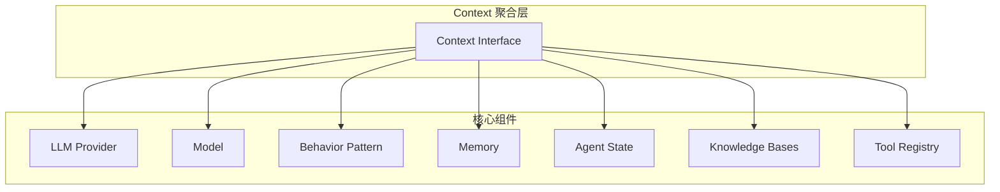
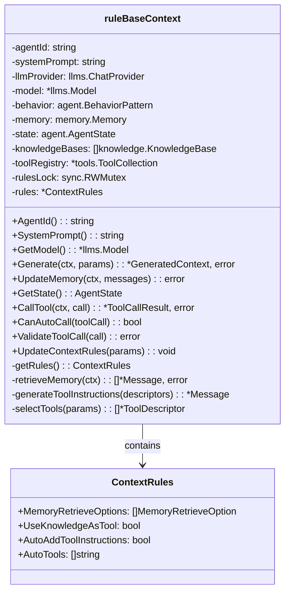
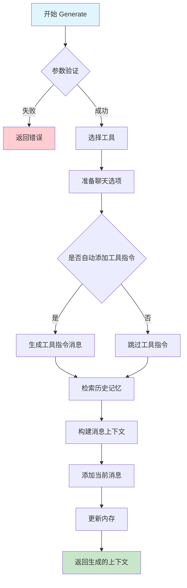

# Agent Context 模块设计

## 概述

Context 模块是 Agent 系统的核心组件，它作为模型、SystemPrompt、内存、状态、知识库和工具的聚合器，为 Agent 提供统一的上下文管理能力。Context 负责协调各个子系统的交互，生成适合 LLM 处理的上下文信息。

## 核心架构



## 核心数据结构

### Context 接口

```go
type Context interface {
    SystemPrompt() string
    GetModel() *llms.Model
    UpdateMemory(ctx context.Context, messages ...*llms.Message) error
    GetState() AgentState

    Generate(ctx context.Context, params *GenerateContextParams) (*GeneratedContext, error)
    CallTool(ctx context.Context, call *llms.ToolCall) (*llms.ToolCallResult, error)
}
```

### RuleBaseContext 实现

#### 类图



#### ContextRules 配置说明

```go
type ContextRules struct {
    MemoryRetrieveOptions   []memory.MemoryRetrieveOption  // 内存检索选项
    UseKnowledgeAsTool      bool                           // 是否将知识库作为工具使用
    AutoAddToolInstructions bool                           // 是否自动添加工具指令
    AutoTools               []string                       // 自动调用工具列表
}
```

**配置项说明**：
- **MemoryRetrieveOptions**: 控制从内存中检索历史消息的策略和选项
- **UseKnowledgeAsTool**: 当为 true 时，将知识库包装为检索工具并添加到工具注册表
- **AutoAddToolInstructions**: 当为 true 时，自动生成工具使用说明并添加到消息上下文
- **AutoTools**: 指定可以自动调用的工具名称列表，无需用户确认

#### Generate 方法流程



## 聚合特性

### 1. 模型聚合
- **LLM Provider**: 提供与语言模型的通信能力
- **Model**: 定义使用的模型参数和配置
- **Behavior Pattern**: 控制 Agent 的行为模式（如 CoT、ReAct 等）

### 2. 提示词聚合
- **System Prompt**: 基础系统提示词
- **Behavior Integration**: 通过行为模式增强系统提示词
- **Tool Instructions**: 自动生成工具使用说明

### 3. 内存聚合
- **Memory Interface**: 统一的内存访问接口
- **Memory Retrieval**: 基于规则的记忆检索
- **Memory Update**: 自动更新对话历史

### 4. 状态聚合
- **Agent State**: 提供键值对状态存储
- **Thread Safety**: 线程安全的状态访问
- **Persistence**: 支持状态持久化

### 5. 知识库聚合
- **Knowledge Bases**: 多个知识库的统一管理
- **Tool Integration**: 可选择将知识库作为工具使用
- **Retrieval**: 智能知识检索能力

### 6. 工具聚合
- **Tool Registry**: 工具注册和管理
- **Tool Validation**: 工具调用验证
- **Auto Tools**: 自动工具调用支持

## 核心方法

### Generate 方法
```go
func (r *ruleBaseContext) Generate(ctx context.Context, params *GenerateContextParams) (*GeneratedContext, error)
```

**功能**: 生成完整的上下文信息，包括：
1. 基于规则选择工具
2. 准备聊天选项
3. 检索历史记忆
4. 生成工具指令
5. 更新内存

### UpdateMemory 方法
```go
func (r *ruleBaseContext) UpdateMemory(ctx context.Context, messages ...*llms.Message) error
```

**功能**: 将消息添加到内存中，支持：
- 消息格式转换
- 日志记录
- 错误处理

### CallTool 方法
```go
func (r *ruleBaseContext) CallTool(ctx context.Context, call *llms.ToolCall) (*llms.ToolCallResult, error)
```

**功能**: 执行工具调用，包括：
- 工具验证
- 执行日志
- 结果返回

## 设计特点

### 1. 聚合设计
Context 作为多个子系统的聚合器，提供统一的接口和协调能力。

### 2. 规则驱动
通过 ContextRules 配置各种行为，支持动态规则更新。

### 3. 线程安全
使用读写锁保护共享状态，确保并发安全。

### 4. 可扩展性
接口化设计支持不同的实现，便于扩展和测试。

### 5. 日志集成
完整的日志记录，便于调试和监控。

## 使用场景

1. **对话生成**: 为 LLM 提供完整的上下文信息
2. **工具调用**: 管理和执行各种工具
3. **记忆管理**: 维护对话历史和状态
4. **知识检索**: 提供相关知识支持
5. **行为控制**: 根据规则调整 Agent 行为

## 设计要点

1. **接口统一**: 所有上下文实现相同的接口规范
2. **类型安全**: 基于Schema的参数定义和运行时类型检查
3. **可扩展性**: 支持多种上下文规则，模块化设计便于扩展
4. **性能优化**: 支持缓存和异步处理，提供高效的上下文生成

## 总结

Agent Context 模块提供了统一的上下文管理抽象，支持多种上下文规则的集成。通过标准化的接口设计，实现了对不同上下文生成服务的统一管理。

该模块的核心价值在于为 Agent 提供了智能的上下文生成能力，支持用户请求、记忆、知识库、工具等信息的聚合。通过规则引擎的支持，Agent 可以根据不同的场景生成合适的上下文，提高对话质量和响应准确性。

模块设计注重实用性和扩展性，提供了灵活的配置选项和错误处理机制，为上层应用提供了稳定可靠的上下文管理服务基础。
