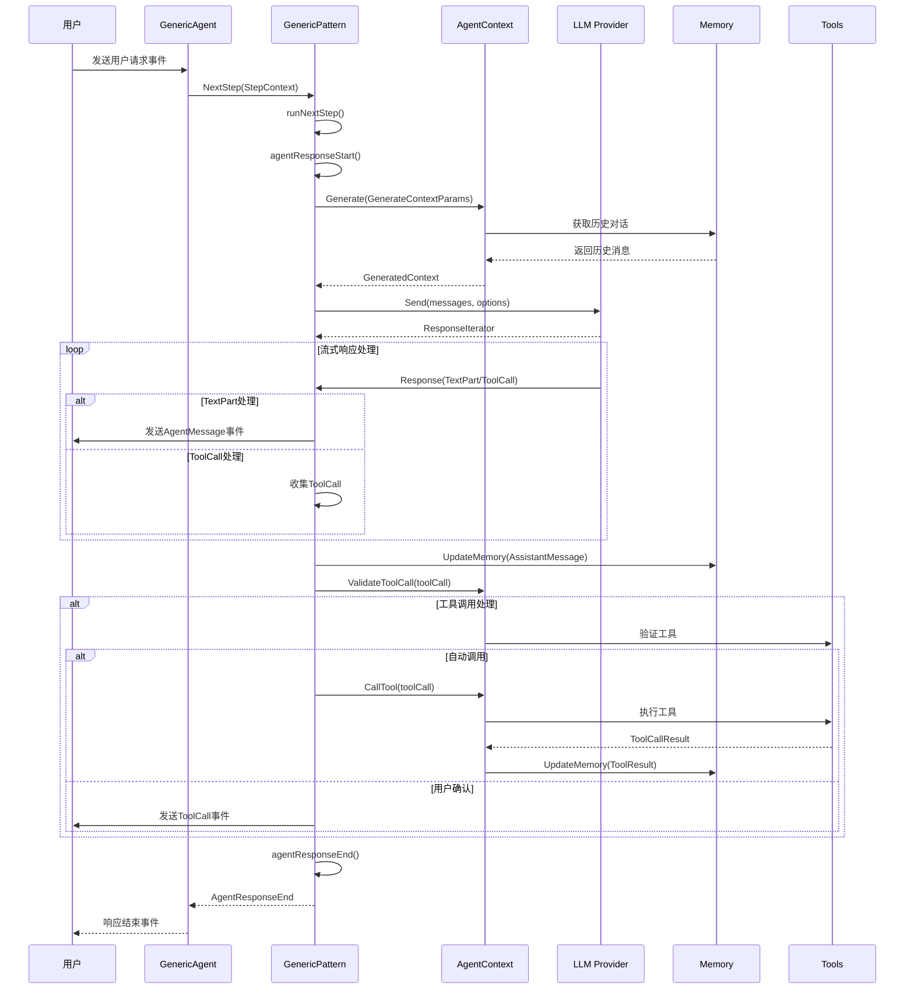
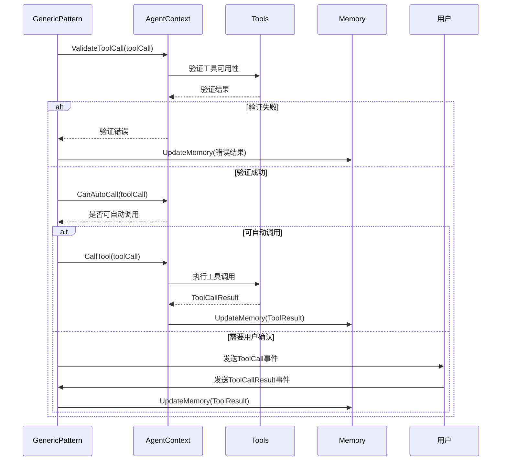
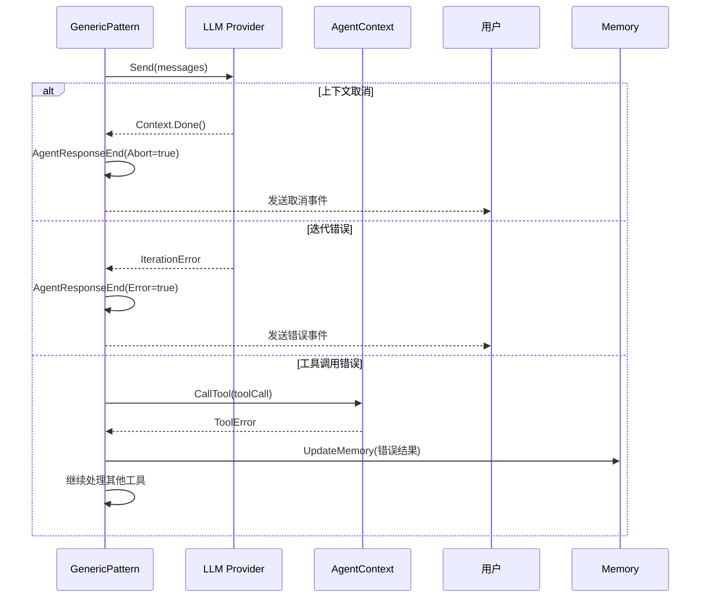

# Agent 通用行为模式设计

## 概述

Agent通用行为模式是agent-go框架中的核心行为模式之一，提供了基础的Agent交互能力。该模式实现了标准的"接收输入-处理-输出"循环，支持用户请求处理和工具调用功能。

## 整体架构

```
┌─────────────────┐    ┌─────────────────┐    ┌─────────────────┐
│   User Input    │───▶│  Generic Agent  │───▶│  LLM Provider   │
│   (Events)      │    │                 │    │                 │
└─────────────────┘    └─────────────────┘    └─────────────────┘
                                │
                                ▼
                       ┌─────────────────┐
                       │ Behavior Pattern│
                       │   (Generic)     │
                       └─────────────────┘
                                │
                                ▼
                       ┌─────────────────┐
                       │ Agent Context   │
                       │                 │
                       └─────────────────┘
                                │
                                ▼
                       ┌─────────────────┐
                       │   Memory &      │
                       │   Tools         │
                       └─────────────────┘
```

## 核心组件

### 1. GenericAgent
- **职责**: Agent的主要执行引擎
- **核心方法**:
  - `Run()`: 启动Agent运行循环
  - `startLoop()`: 处理输入事件的主循环
  - `nextStep()`: 执行单个处理步骤

### 2. GenericPattern
- **职责**: 实现通用行为模式逻辑
- **核心方法**:
  - `SystemInstruction()`: 返回系统指令
  - `NextStep()`: 执行下一步处理

### 3. StepContext
- **职责**: 封装单步执行的上下文信息
- **核心字段**:
  - `Context`: 执行上下文
  - `AgentContext`: Agent上下文
  - `UserRequest`: 用户请求
  - `ToolCallResult`: 工具调用结果
  - `Session`: LLM会话
  - `OutputChan`: 输出通道

### 4. AgentContext
- **职责**: 管理Agent的状态和上下文
- **核心方法**:
  - `Generate()`: 生成上下文
  - `UpdateMemory()`: 更新记忆
  - `CallTool()`: 调用工具
  - `ValidateToolCall()`: 验证工具调用

## 执行流程

### 1. 初始化阶段
```
1. 创建GenericAgent实例
2. 初始化LLM会话
3. 设置输入/输出通道
4. 启动事件处理循环
```

### 2. 事件处理循环
```
1. 监听输入事件
2. 根据事件类型创建StepContext
3. 调用行为模式的NextStep方法
4. 处理执行结果
```

### 3. 单步执行流程
```
1. 生成当前步骤的上下文
2. 发送消息到LLM提供者
3. 处理LLM响应流
4. 处理文本部分和工具调用
5. 自动调用或等待用户确认工具
6. 更新记忆
7. 返回执行结果
```

### 4. 工具调用处理
```
1. 验证工具调用
2. 检查是否可自动调用
3. 自动调用或等待用户确认
4. 处理工具调用结果
5. 更新记忆
```

## GenericPattern 交互序列图

### 基础交互流程



### 工具调用详细流程



### 错误处理流程



## 事件系统

### 输入事件类型
- `EventTypeUserRequest`: 用户请求事件
- `EventTypeExternalActionResult`: 外部操作结果事件

### 输出事件类型
- `EventTypeAgentResponseStart`: Agent响应开始
- `EventTypeAgentMessage`: Agent消息
- `EventTypeExternalAction`: 外部操作（工具调用）
- `EventTypeAgentResponseEnd`: Agent响应结束

## 关键特性

### 1. 流式处理
- 支持LLM响应的流式处理
- 实时输出文本内容
- 支持工具调用的实时处理

### 2. 工具调用管理
- 自动工具调用验证
- 支持自动调用和用户确认两种模式
- 工具调用结果处理

### 3. 记忆管理
- 自动更新对话记忆
- 支持工具调用结果记忆
- 上下文生成和管理

### 4. 错误处理
- 完善的错误处理机制
- 支持执行取消
- 错误状态反馈

## 扩展点

### 1. 自定义文本处理
- 通过`FnHandleStepTextPart`函数自定义文本处理逻辑
- 支持实时文本内容处理

### 2. 自定义结束处理
- 通过`FnHandleBeforeEnd`函数自定义结束条件
- 支持复杂的结束逻辑

### 3. 行为模式扩展
- 实现`BehaviorPattern`接口创建新的行为模式
- 复用通用的执行框架

## 使用场景

1. **基础对话**: 简单的问答交互
2. **工具调用**: 需要调用外部工具的复杂任务
3. **多轮对话**: 支持上下文的连续对话
4. **流式输出**: 需要实时响应的场景

## 设计要点

1. **接口统一**: 所有行为模式实现相同的接口规范
2. **类型安全**: 基于Schema的参数定义和运行时类型检查
3. **可扩展性**: 支持多种行为模式，模块化设计便于扩展
4. **性能优化**: 支持流式处理和异步操作，提供高效的响应生成

## 总结

Generic Behavior Pattern 模块提供了通用的 Agent 行为模式实现，支持基础的对话和推理功能。通过标准化的接口设计，实现了对不同行为模式的统一管理。

该模块的核心价值在于为 Agent 提供了灵活的行为模式选择，支持从简单对话到复杂推理的各种应用场景。通过流式处理和异步操作的支持，提供了良好的用户体验和系统性能。

模块设计注重实用性和扩展性，提供了灵活的配置选项和错误处理机制，为上层应用提供了稳定可靠的行为模式服务基础。
