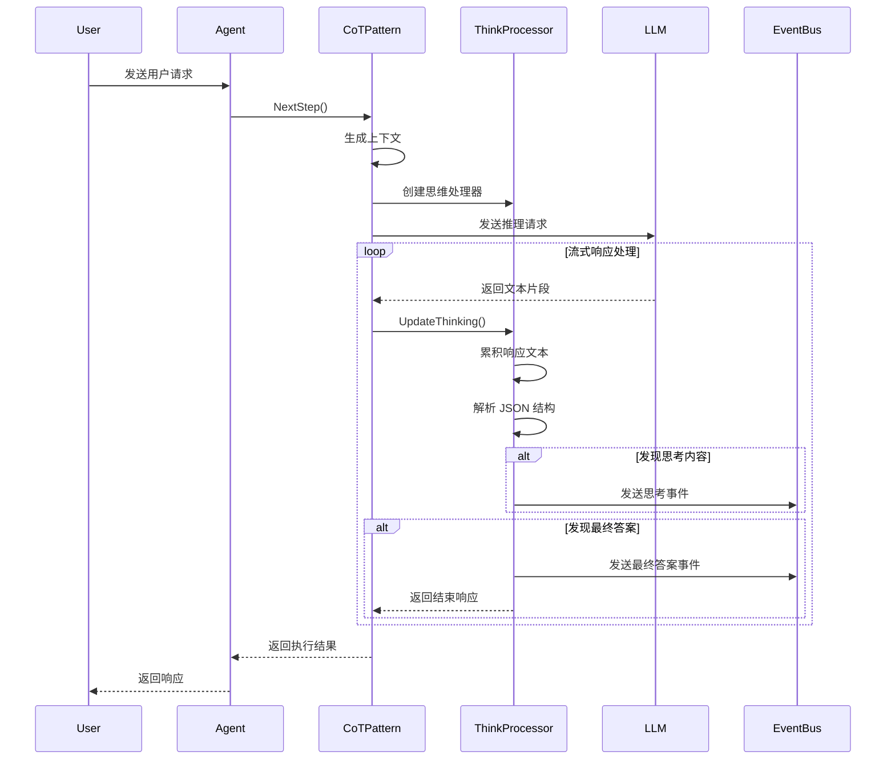

# Agent CoT 行为模式设计文档

## 概述

Chain of Thought (CoT) 行为模式是 Agent 框架中的一种核心推理模式，它通过结构化思维过程来增强 AI 的推理能力。该模式要求 AI 在回答问题时展示完整的思考过程，从而提高推理的透明度和准确性。

## 整体架构

CoT 行为模式基于 Agent 框架的通用行为模式接口，通过以下核心组件实现：

```
┌────────────────────────────────────────────────────────────┐
│                    CoT Behavior Pattern                    │
├────────────────────────────────────────────────────────────┤
│  ┌─────────────────┐    ┌─────────────────┐                │
│  │   SystemPrompt  │    │   NextStep      │                │
│  │   Generation    │    │   Processing    │                │
│  └─────────────────┘    └─────────────────┘                │
├────────────────────────────────────────────────────────────┤
│  ┌─────────────────┐    ┌─────────────────┐                │
│  │ ThinkState      │    │ COTResponse     │                │
│  │ Processor       │    │ Parser          │                │
│  └─────────────────┘    └─────────────────┘                │
└────────────────────────────────────────────────────────────┘
                              │
                              ▼
┌────────────────────────────────────────────────────────────┐
│                    Generic Agent Framework                 │
├────────────────────────────────────────────────────────────┤
│  ┌─────────────────┐    ┌─────────────────┐                │
│  │   Context       │    │   Memory        │                │
│  │   Management    │    │   System        │                │
│  └─────────────────┘    └─────────────────┘                │
├────────────────────────────────────────────────────────────┤
│  ┌─────────────────┐    ┌─────────────────┐                │
│  │   LLM Provider  │    │   Event Bus     │                │
│  │   Integration   │    │   System        │                │
│  └─────────────────┘    └─────────────────┘                │
└────────────────────────────────────────────────────────────┘
```

## 核心数据结构

### COTResponse
```go
type COTResponse struct {
    Thinking    string `json:"thinking"`    // 思考过程
    FinalAnswer string `json:"final_answer"` // 最终答案
}
```

### chainOfThoughtPattern
```go
type chainOfThoughtPattern struct {
    // 实现 BehaviorPattern 接口
}
```

### thinkStateProcessor
```go
type thinkStateProcessor struct {
    responseBuffer *strings.Builder    // 响应缓冲区
    cotResponse    *COTResponse        // COT 响应对象
    outputChan     chan<- *eventbus.Event // 事件输出通道
}
```

## 核心方法

### 1. SystemInstruction
- **功能**: 生成包含 CoT 提示的系统指令
- **实现**: 将通用头部与 CoT 专用提示模板组合

### 2. NextStep
- **功能**: 执行 CoT 推理的下一步
- **流程**: 
  1. 生成当前步骤的上下文
  2. 创建思维状态处理器
  3. 调用 LLM 进行推理
  4. 处理响应并发送事件

### 3. UpdateThinking
- **功能**: 实时更新思考过程
- **处理**: 
  - 累积响应文本
  - 解析 JSON 结构
  - 发送思考事件

### 4. EndIfGotFinalAnswer
- **功能**: 检查是否获得最终答案
- **逻辑**: 解析完整响应，发送最终答案事件

## 交互流程

### CoT Pattern 执行序列图



### 详细执行流程

1. **初始化阶段**
   - Agent 接收用户请求
   - 创建 StepContext
   - 调用 CoT Pattern 的 NextStep 方法

2. **上下文生成**
   - 根据用户请求和工具调用结果生成上下文
   - 准备发送给 LLM 的消息列表

3. **思维处理**
   - 创建 thinkStateProcessor 实例
   - 配置文本处理和结束检查函数

4. **LLM 交互**
   - 发送消息到 LLM Provider
   - 处理流式响应
   - 实时解析 JSON 结构

5. **事件发送**
   - 发送思考过程事件
   - 发送最终答案事件
   - 更新内存状态

6. **完成处理**
   - 检查是否获得最终答案
   - 返回执行结果

## 关键特性

### 1. 结构化输出
- 强制 LLM 以 JSON 格式输出思考过程和最终答案
- 使用正则表达式解析 JSON 结构
- 支持流式响应的实时解析

### 2. 事件驱动
- 通过事件总线发送思考过程
- 实时更新用户界面
- 支持异步处理

### 3. 错误处理
- 优雅处理 JSON 解析失败
- 支持上下文取消
- 完整的错误传播机制

### 4. 内存管理
- 自动更新对话历史
- 支持工具调用结果记录
- 保持会话状态一致性

## 设计要点

1. **接口统一**: 所有行为模式实现相同的接口规范
2. **类型安全**: 基于Schema的参数定义和运行时类型检查
3. **可扩展性**: 支持多种推理模式，模块化设计便于扩展
4. **性能优化**: 支持流式处理和异步操作，提供高效的推理生成

## 总结

Chain of Thought Behavior Pattern 模块提供了思维链推理的行为模式实现，支持逐步推理和复杂问题解决。通过标准化的接口设计，实现了对不同推理模式的统一管理。

该模块的核心价值在于为 Agent 提供了结构化的推理能力，通过显式的思维过程提高问题解决的准确性和可解释性。通过流式处理和异步操作的支持，提供了良好的用户体验和系统性能。

模块设计注重实用性和扩展性，提供了灵活的配置选项和错误处理机制，为上层应用提供了稳定可靠的推理模式服务基础。
