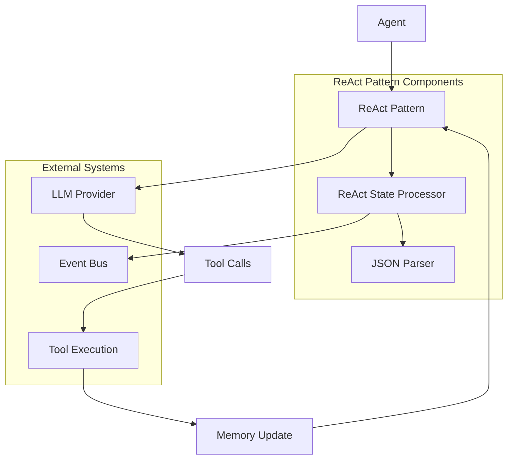
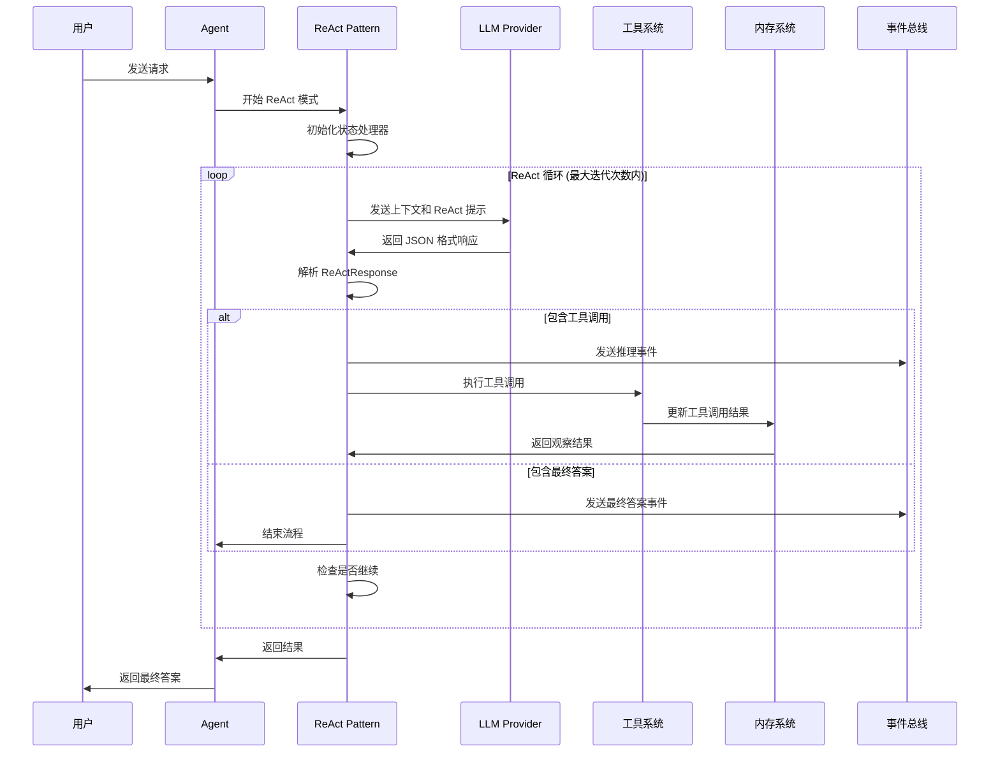

# Agent ReAct 行为模式设计

## 概述

ReAct (Reasoning and Acting) 行为模式是一种结合推理和行动的智能体行为模式。该模式通过循环的思考-行动-观察过程来解决问题，使智能体能够逐步推理并执行相应的工具调用来完成任务。

## 核心架构



## 核心数据结构

### ReActResponse
ReAct 模式的核心响应结构，用于解析 LLM 的 JSON 格式响应：

```go
type ReActResponse struct {
    Thought     string           // 推理过程
    Action      string           // 行动描述
    ToolCalls   []*llms.ToolCall // 工具调用列表
    Observation string           // 观察结果
    Answer      string           // 最终答案
    Continue    bool             // 是否继续循环
}
```

### reactPattern
ReAct 行为模式的主要实现结构：

```go
type reactPattern struct {
    maxIterations int  // 最大迭代次数
    iterations    int  // 当前迭代次数
}
```

### reactStateProcessor
处理 ReAct 状态和响应的处理器：

```go
type reactStateProcessor struct {
    finalAnswer *strings.Builder // 最终答案构建器
    outputChan  chan<- *eventbus.Event // 事件输出通道
    jsonBuffer  *strings.Builder // JSON 缓冲区
}
```

## 核心方法

### 主要接口方法
- `SystemInstruction()`: 生成系统指令，包含 ReAct 提示词
- `NextStep()`: 执行下一步推理和行动
- `nextStep()`: 核心的 ReAct 循环逻辑

### 状态处理方法
- `UpdateReAct()`: 更新 ReAct 状态，解析响应并处理工具调用
- `EndIfGotFinalAnswer()`: 检查是否获得最终答案并结束流程
- `parseReActResponse()`: 解析 ReAct JSON 响应
- `extractJSONBlocks()`: 从文本中提取 JSON 块

## 交互流程

### ReAct 模式执行流程



### 详细执行步骤

1. **初始化阶段**
   - 创建 ReAct 模式实例，设置最大迭代次数
   - 初始化状态处理器，准备 JSON 缓冲区

2. **循环执行阶段**
   - 生成当前步骤的上下文信息
   - 向 LLM 发送包含 ReAct 提示的系统指令
   - 解析 LLM 返回的 JSON 格式响应

3. **响应处理阶段**
   - 提取 JSON 块并解析为 ReActResponse 结构
   - 处理推理过程，发送推理事件
   - 处理工具调用，执行相应工具
   - 处理观察结果，更新内存

4. **结束判断阶段**
   - 检查是否获得最终答案
   - 检查是否达到最大迭代次数
   - 决定是否继续循环或结束流程

## 关键特性

### 1. JSON 格式响应
ReAct 模式要求 LLM 以特定的 JSON 格式返回响应，确保结构化的推理和行动过程。

### 2. 迭代控制
通过最大迭代次数限制，防止无限循环，确保流程能够正常结束。

### 3. 事件驱动
通过事件总线发送推理过程和最终答案事件，支持实时监控和日志记录。

### 4. 工具集成
自动处理工具调用，支持工具验证和自动执行，简化工具使用流程。

### 5. 内存管理
自动更新对话历史和工具调用结果到内存系统，保持上下文连续性。

## 使用场景

ReAct 模式特别适用于：
- 需要多步骤推理的复杂问题
- 需要调用多个工具的任务
- 需要逐步探索和验证的查询
- 需要结构化思考过程的应用场景

## 配置参数

- `maxIterations`: 最大迭代次数，防止无限循环
- 系统提示词：包含 ReAct 模式的详细指导和使用说明

## 错误处理

- JSON 解析错误：记录警告并跳过无效响应
- 工具调用错误：验证工具调用并记录错误状态
- 迭代超限：达到最大迭代次数时自动结束流程
- 上下文取消：支持用户取消操作

## 设计要点

1. **接口统一**: 所有行为模式实现相同的接口规范
2. **类型安全**: 基于Schema的参数定义和运行时类型检查
3. **可扩展性**: 支持多种推理模式，模块化设计便于扩展
4. **性能优化**: 支持流式处理和异步操作，提供高效的推理生成

## 总结

ReAct Behavior Pattern 模块提供了推理与行动结合的行为模式实现，支持工具调用和复杂问题解决。通过标准化的接口设计，实现了对不同推理模式的统一管理。

该模块的核心价值在于为 Agent 提供了动态的工具调用能力，通过推理和行动的循环迭代解决复杂问题。通过流式处理和异步操作的支持，提供了良好的用户体验和系统性能。

模块设计注重实用性和扩展性，提供了灵活的配置选项和错误处理机制，为上层应用提供了稳定可靠的推理模式服务基础。
