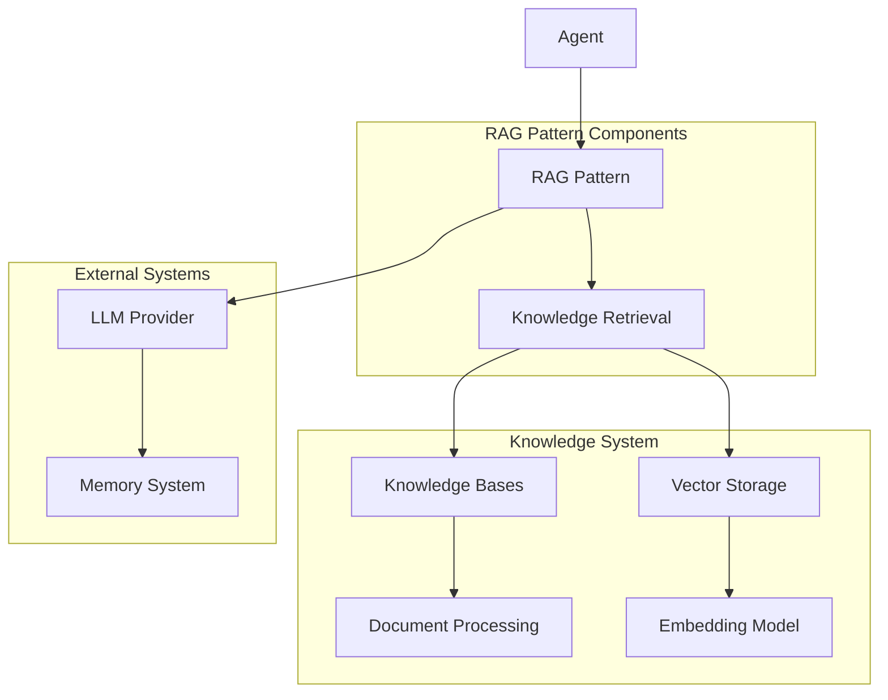
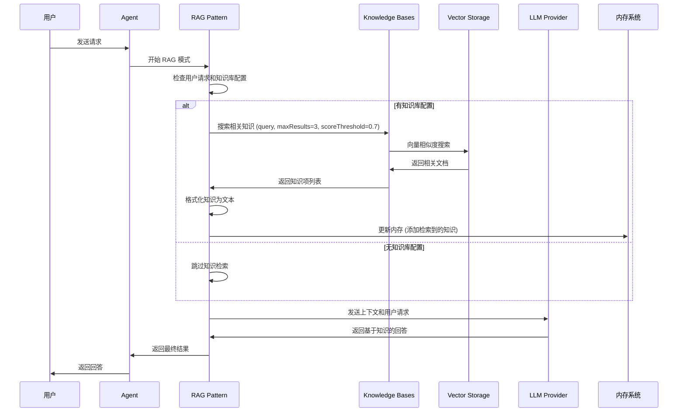

# Agent RAG 行为模式设计

## 概述

RAG (Retrieval-Augmented Generation) 行为模式是一种结合知识检索和生成的智能体行为模式。该模式通过从知识库中检索相关信息，然后将检索到的知识作为上下文提供给 LLM，使智能体能够基于特定知识库提供准确、可靠的回答。

## 核心架构



## 核心数据结构

### ragPattern
RAG 行为模式的主要实现结构：

```go
type ragPattern struct {
    knowledgeBases []knowledge.KnowledgeBase  // 知识库列表
}
```

### KnowledgeBase 接口
知识库的核心接口，提供检索功能：

```go
type KnowledgeBase interface {
    Search(ctx context.Context, query string, opts ...SearchOption) ([]KnowledgeItem, error)
    // 其他管理方法...
}
```

### KnowledgeItem 接口
知识项接口，表示知识库中的单个知识单元：

```go
type KnowledgeItem interface {
    GetId() document.DocumentId
    ToDocument() *document.Document
    // 其他方法...
}
```

## 核心方法

### 主要接口方法
- `SystemInstruction()`: 生成系统指令，包含 RAG 提示词
- `NextStep()`: 执行 RAG 流程的下一步
- `nextStep()`: 核心的 RAG 处理逻辑

### 知识检索方法
- `rag()`: 执行知识检索和上下文更新
- `retrieveKnowledge()`: 从知识库检索相关知识
- `makeKnowledgeText()`: 将检索到的知识格式化为文本

## 交互流程

### RAG 模式执行流程



### 详细执行步骤

1. **初始化阶段**
   - 创建 RAG 模式实例，配置知识库列表
   - 验证用户请求和知识库配置

2. **知识检索阶段**
   - 遍历所有配置的知识库
   - 对每个知识库执行语义搜索
   - 应用搜索参数：最大结果数(3)、相似度阈值(0.7)
   - 合并所有知识库的检索结果

3. **知识格式化阶段**
   - 将检索到的知识项转换为文档格式
   - 格式化知识内容，包含 ID、内容和元数据
   - 生成结构化的知识文本

4. **上下文更新阶段**
   - 将格式化的知识文本添加到内存系统
   - 为 LLM 提供检索到的知识作为上下文

5. **生成回答阶段**
   - 向 LLM 发送包含检索知识的完整上下文
   - 使用 RAG 提示词指导 LLM 基于知识生成回答

## 关键特性

### 1. 多知识库支持
RAG 模式支持配置多个知识库，能够从不同来源检索相关信息，提高回答的全面性。

### 2. 语义搜索
基于向量数据库实现高效的语义搜索，能够理解查询意图并找到相关内容。

### 3. 相似度过滤
通过相似度阈值(0.7)过滤低质量匹配，确保检索到的知识具有足够的相关性。

### 4. 结构化知识表示
将检索到的知识格式化为结构化的文本，包含文档 ID、内容和元数据信息。

### 5. 内存集成
自动将检索到的知识更新到内存系统，为后续对话提供上下文连续性。

### 6. 错误容错
对单个知识库的搜索失败进行容错处理，确保整体流程的稳定性。

## 使用场景

RAG 模式特别适用于：
- 需要基于特定知识库回答问题的场景
- 企业知识管理和问答系统
- 文档检索和智能客服
- 需要准确、可追溯信息来源的应用
- 专业领域知识问答

## 配置参数

### 搜索参数
- `MaxResults`: 每个知识库最大返回结果数 (默认: 3)
- `ScoreThreshold`: 相似度阈值 (默认: 0.7)
- 知识库列表：支持配置多个知识库

### 系统提示词
包含 RAG 模式的详细指导，要求 LLM：
1. 仔细审查检索到的知识内容
2. 识别与用户问题最相关的信息
3. 综合信息提供全面回答
4. 承认知识限制（如果检索的知识无法完全回答问题）
5. 基于检索到的知识提供准确回答

## 错误处理

- **知识库搜索失败**：记录警告日志，跳过失败的知识库，继续处理其他知识库
- **无知识库配置**：记录信息日志，跳过知识检索步骤
- **空用户请求**：直接跳过知识检索
- **知识格式化错误**：确保知识项到文档的转换安全进行

## 性能优化

### 1. 顺序搜索
当前实现采用顺序搜索多个知识库，每个知识库依次执行搜索操作。

### 2. 结果限制
通过最大结果数限制，避免返回过多无关信息，提高回答质量。

### 3. 相似度过滤
通过相似度阈值过滤，确保只使用高质量的相关知识。

### 4. 缓存机制
知识库的向量存储支持缓存机制，提高重复查询的响应速度。

## 设计要点

1. **接口统一**: 所有行为模式实现相同的接口规范
2. **类型安全**: 基于Schema的参数定义和运行时类型检查
3. **可扩展性**: 支持多种知识检索模式，模块化设计便于扩展
4. **性能优化**: 支持流式处理和异步操作，提供高效的知识检索

## 总结

RAG Behavior Pattern 模块提供了检索增强生成的行为模式实现，支持知识库查询和智能问答。通过标准化的接口设计，实现了对不同知识检索模式的统一管理。

该模块的核心价值在于为 Agent 提供了强大的知识检索能力，通过向量搜索和知识增强提高回答的准确性和相关性。通过流式处理和异步操作的支持，提供了良好的用户体验和系统性能。

模块设计注重实用性和扩展性，提供了灵活的配置选项和错误处理机制，为上层应用提供了稳定可靠的知识检索模式服务基础。
