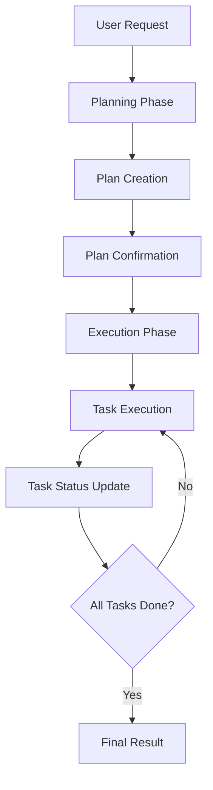
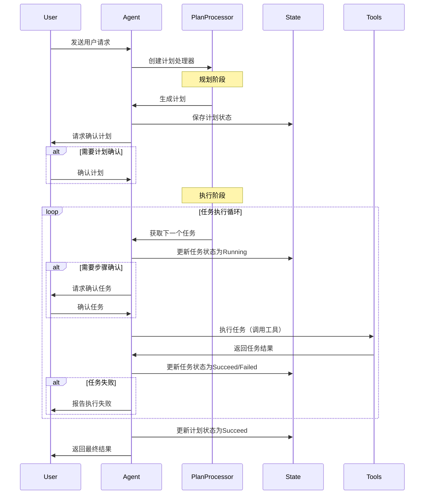

# Agent Plan and Execute 行为模式设计文档

## 概述

Plan and Execute 行为模式是一种结构化的 AI Agent 执行模式，将复杂任务分解为可管理的步骤，通过规划和执行两个主要阶段来完成任务。

## 核心架构

### 整体架构图



### 核心数据结构

#### PlanAndExecuteConfig
```go
type PlanAndExecuteConfig struct {
    RequirePlanConfirmation bool // 是否需要用户确认计划
    RequireStepConfirmation bool // 是否需要用户确认每个步骤
}
```

#### Plan
```go
type Plan struct {
    State PlanState `json:"state"` // 计划状态
    Tasks []*Task   `json:"tasks"` // 任务列表
}
```

#### Task
```go
type Task struct {
    ID          string    `json:"id"`           // 任务唯一标识
    Description string    `json:"description"`  // 任务描述
    State       TaskState `json:"state"`        // 任务状态
    Result      string    `json:"result"`       // 任务结果
}
```

#### PlanAndExecuteAgentResponse
```go
type PlanAndExecuteAgentResponse struct {
    PlanResult         *Plan     `json:"planResult"`         // 计划结果
    CurrentTaskStatus  *Task     `json:"currentTaskStatus"`  // 当前任务状态
    ExecuteState       PlanState `json:"executeState"`       // 执行状态
    Reason             string    `json:"reason"`             // 响应原因
    FinalResult        string    `json:"finalResult"`        // 最终结果
}
```

### 状态定义

#### PlanState
- `Pending`: 计划待执行
- `Executing`: 正在执行
- `Succeed`: 执行成功
- `Failed`: 执行失败

#### TaskState
- `Pending`: 任务待执行
- `Running`: 任务执行中
- `Succeed`: 任务成功
- `Failed`: 任务失败
- `Skipped`: 任务跳过

## 交互流程

### Plan and Execute Pattern 交互序列图



## 核心方法

### planAndExecutePattern
- `SystemInstruction()`: 生成系统指令
- `NextStep()`: 执行下一步操作
- `nextStep()`: 核心执行逻辑

### planAndExecuteProcessor
- `OnBeforeEnd()`: 处理LLM响应结束前的逻辑
- `parseAgentResponse()`: 解析Agent响应
- `savePlan()`: 保存计划到状态
- `updatePlan()`: 更新计划状态
- `loadPlan()`: 从状态加载计划
- `requireConfirmPlan()`: 请求确认计划
- `requireConfirmTask()`: 请求确认任务
- `planAbort()`: 处理计划中止
- `planDone()`: 处理计划完成

## 使用示例

### 基本使用
```go
config := &behavior_patterns.PlanAndExecuteConfig{
    RequirePlanConfirmation: true,
    RequireStepConfirmation: true,
}

behavior, err := behavior_patterns.NewPlanExecutePattern(config)
```

### 响应格式示例

#### 创建计划
```json
{
  "planResult": {
    "state": "Pending",
    "tasks": [
      {
        "id": "task-1",
        "description": "Research topic and gather information",
        "state": "Pending"
      }
    ]
  },
  "executeState": "Pending",
  "reason": "Created initial plan"
}
```

#### 执行任务
```json
{
  "currentTaskStatus": {
    "id": "task-1",
    "description": "Research topic and gather information",
    "state": "Running"
  },
  "executeState": "Executing",
  "reason": "Started executing task-1"
}
```

## 设计要点

1. **接口统一**: 所有行为模式实现相同的接口规范
2. **类型安全**: 基于Schema的参数定义和运行时类型检查
3. **可扩展性**: 支持多种计划执行模式，模块化设计便于扩展
4. **性能优化**: 支持流式处理和异步操作，提供高效的任务分解

## 总结

Plan and Execute Behavior Pattern 模块提供了计划执行的行为模式实现，支持任务分解和分步执行。通过标准化的接口设计，实现了对不同计划执行模式的统一管理。

该模块的核心价值在于为 Agent 提供了结构化的任务处理能力，通过任务分解和分步执行提高复杂问题的解决效率。通过流式处理和异步操作的支持，提供了良好的用户体验和系统性能。

模块设计注重实用性和扩展性，提供了灵活的配置选项和错误处理机制，为上层应用提供了稳定可靠的计划执行模式服务基础。
