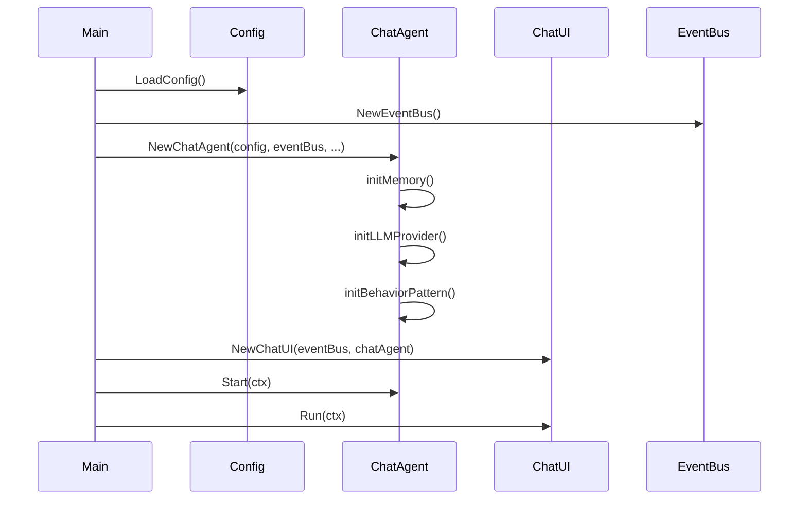
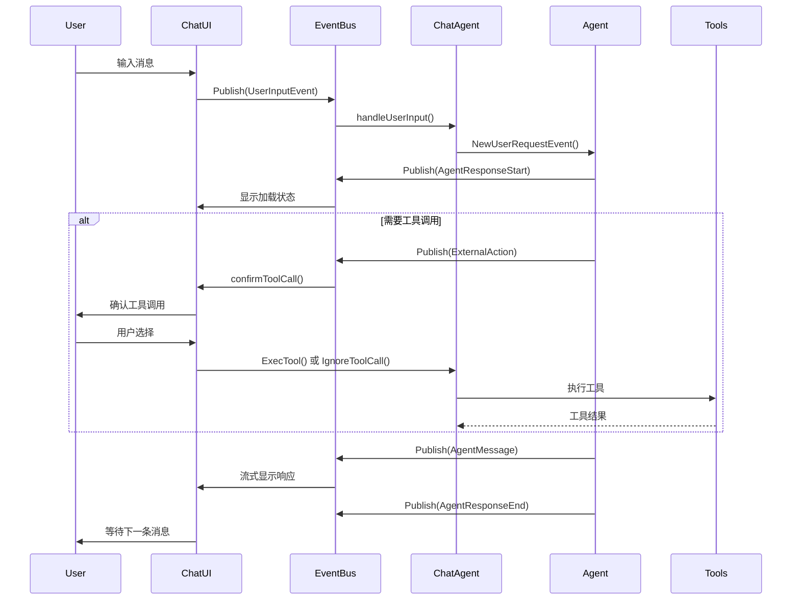
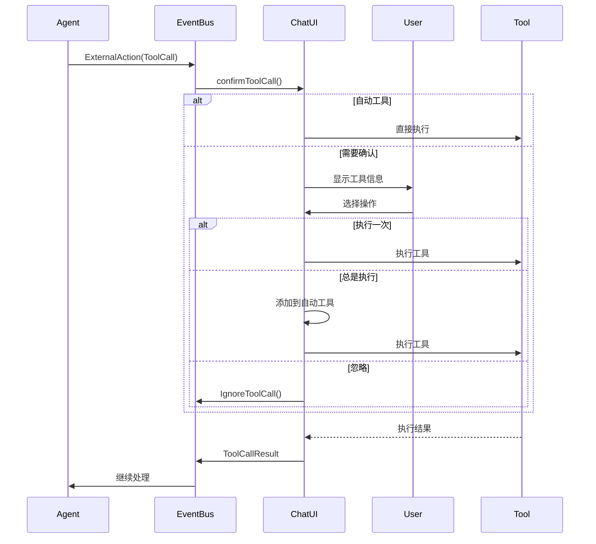

# Chat App 设计文档

## 概述

Chat App 是基于 agent-go 框架构建的交互式聊天应用程序，支持多种 AI 模型提供商，具备知识库检索、工具调用、记忆管理等功能。

## 整体架构

### 核心组件关系

```
┌─────────────────┐    ┌─────────────────┐    ┌─────────────────┐
│   Command Line  │    │   Event Bus     │    │   Chat Agent    │
│      UI         │◄──►│                 │◄──►│                 │
└─────────────────┘    └─────────────────┘    └─────────────────┘
         │                       │                       │
         ▼                       ▼                       ▼
┌─────────────────┐    ┌─────────────────┐    ┌─────────────────┐
│   Configuration │    │   Knowledge     │    │   Tool Registry │
│                 │    │   Base          │    │                 │
└─────────────────┘    └─────────────────┘    └─────────────────┘
```

### 主要模块

1. **UI 模块**: 命令行用户界面
2. **Agent 模块**: 聊天代理核心逻辑  
3. **配置模块**: 应用程序配置管理
4. **知识库模块**: 向量数据库和知识检索
5. **工具模块**: MCP 工具和自定义工具

## 核心数据结构

### ChatAgent
```go
type ChatAgent struct {
    agent              agent.Agent
    memory             memory.Memory
    toolRegistry       *tools.ToolCollection
    knowledgeBases     []knowledge.KnowledgeBase
    eventBus           *eventbus.EventBus
    inputChan          chan<- *eventbus.Event
}
```

### ChatUI
```go
type ChatUI struct {
    eventBus           *eventbus.EventBus
    uiChan             chan *eventbus.Event
    chatAgentCtrl      chatagent.ChatAgentCtrl
    autoTools          []string
}
```

## 交互流程

### 1. 应用程序启动流程



### 2. 用户消息处理流程



### 3. 工具调用确认流程



## 事件系统

### 事件类型
- `chat:user_input`: 用户输入事件
- `agent:message`: 代理消息事件  
- `agent:external_action`: 外部操作事件
- `agent:response_start`: 响应开始事件
- `agent:response_end`: 响应结束事件

### 事件流
```
User Input → EventBus → ChatAgent → Agent → EventBus → ChatUI → User
```

## 配置管理

### 配置结构
```go
type Config struct {
    Provider     string
    APIKey       string
    BaseURL      string
    ModelName    string
    SystemPrompt string
    VectorDB     VectorDBConfig
    Embedder     EmbedderConfig
}
```

## 知识库集成

### 知识库类型
- **Mock**: 测试环境
- **Milvus**: 生产环境向量数据库

### 知识检索流程
1. 用户查询触发知识检索
2. 使用 `ag_knowledge_retriever` 工具
3. 向量化查询并检索相关文档
4. 将检索结果作为上下文提供给 Agent

## 工具系统

### 内置工具
- **Sleep**: 延时工具
- **DuckDuckGo**: 网络搜索工具
- **MCP 工具**: 外部工具集成

### 工具调用机制
1. Agent 决定调用工具
2. 发送 ExternalAction 事件
3. UI 确认工具调用
4. 执行工具并返回结果
5. 继续 Agent 处理流程

## 记忆管理

### 记忆操作
- `ClearMemory()`: 清空对话历史
- `RetrieveAllMemory()`: 获取所有记忆
- 自动存储用户输入和 Agent 响应

## 用户界面特性

### 交互模式
- **对话模式**: 直接输入消息
- **命令模式**: 系统命令（以 `:` 开头）

### 系统命令
- `:help`: 显示帮助
- `:clear`: 清空历史
- `:history`: 显示历史
- `:info`: 显示配置
- `:quit`: 退出应用

### 用户体验
- 流式响应显示
- 工具调用确认
- 自动工具管理
- 加载状态指示

## 扩展性

### 插件化架构
- 支持多种 LLM 提供商
- 可扩展的工具系统
- 可配置的知识库后端
- 模块化的事件系统

## 设计要点

1. **接口统一**: 所有组件实现相同的接口规范
2. **类型安全**: 基于Schema的参数定义和运行时类型检查
3. **可扩展性**: 支持多种UI框架和配置模式，模块化设计便于扩展
4. **性能优化**: 支持流式处理和异步操作，提供高效的用户交互

## 总结

Chat App 模块提供了完整的聊天应用实现，支持多种UI框架和配置模式。通过标准化的接口设计，实现了对不同应用模式的统一管理。

该模块的核心价值在于为 Agent 提供了用户友好的交互界面，支持实时对话、工具调用、知识检索等功能。通过流式处理和异步操作的支持，提供了良好的用户体验和系统性能。

模块设计注重实用性和扩展性，提供了灵活的配置选项和错误处理机制，为上层应用提供了稳定可靠的聊天应用服务基础。
